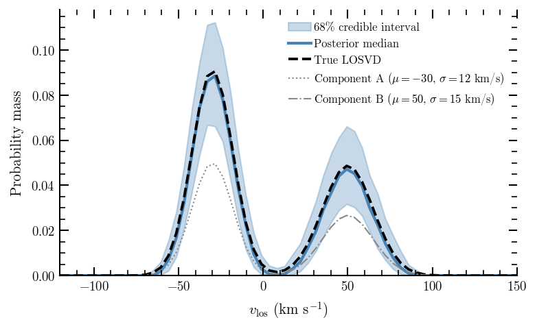

# Examples

## Example 1: Single-bin LOSVD inference

The simplest use case is a single spatial bin containing $N$ stars with
individual velocity measurements and uncertainties.

```python
import numpy as np
from veldist import KinematicSolver

rng = np.random.default_rng(42)

# Intrinsic LOSVD: Gaussian with V = 0, σ = 20 km/s
n_stars = 200
v_int = rng.normal(0.0, 20.0, n_stars)

# Per-star measurement errors, drawn from a realistic range
errors = rng.uniform(5.0, 15.0, n_stars)
v_obs = v_int + rng.normal(0.0, errors)

# Set up the velocity grid and run inference
solver = KinematicSolver()
solver.setup_grid(center=0.0, width=200.0, n_bins=50)
solver.add_data(vel=v_obs, err=errors)
solver.run(num_warmup=500, num_samples=1000, gpu=False)

solver.plot_result()
```

The grid should comfortably enclose the data ($\pm 3\sigma_\mathrm{obs}$ is
a reasonable starting point) and the bin width $\Delta v = \mathrm{width} /
n\_\mathrm{bins}$ should be comparable to the typical measurement uncertainty.
Making $\Delta v$ much smaller than $\varepsilon_\mathrm{typ}$ adds bins that
the data cannot resolve; the prior will fill them in, but the posterior will
be correspondingly wider.

### Recovering a non-Gaussian LOSVD

The same setup applies for non-Gaussian distributions.  Here we use a
double-peaked LOSVD, as might arise from a counter-rotating component or a
contaminating background population:

```python
# Two-component LOSVD: prograde and retrograde populations
n1, n2 = 150, 100
v_int = np.concatenate([
    rng.normal(-30.0, 12.0, n1),   # prograde component
    rng.normal(+50.0, 15.0, n2),   # secondary component
])
errors = rng.uniform(8.0, 18.0, n1 + n2)
v_obs = v_int + rng.normal(0.0, errors)

solver = KinematicSolver()
solver.setup_grid(center=10.0, width=250.0, n_bins=60)
solver.add_data(vel=v_obs, err=errors)
solver.run(num_warmup=500, num_samples=1000, gpu=False)

solver.plot_result()
```

A Gauss-Hermite fit would assign anomalously large $h_3$ or $h_4$ values to
such a distribution; the histogram representation captures both peaks directly.
The `bimodality_score` returned by `compute_summary` will be $\geq 2$ for
bins where this structure is genuinely supported by the data.



*Posterior median (solid) with 68% credible interval (shaded) for the
two-component example above.  The dashed line is the true intrinsic
distribution.  Bins where the uncertainty interval is wide are those
poorly constrained by the data; the prior keeps them smooth rather than
noisy.*

---

## Example 2: Batch inference and Dynamite output

For IFU-style data where stellar velocities have been Voronoi-binned, use
`fit_all_bins` to run inference across all bins and `write_dynamite_kinematics`
to produce the three files expected by Dynamite's `histLOSVD` kinematics
handler.

### Preparing the input

`fit_all_bins` expects a list of dicts, one per Voronoi bin:

```python
# bin_data_list[i] = {'vel': array, 'err': array} for bin i
# Bins with fewer than min_stars stars are skipped and returned as None.
bin_data_list = [
    {'vel': bin_velocities[i], 'err': bin_errors[i]}
    for i in range(n_bins)
]
```

### Running the batch pipeline

```python
from veldist import fit_all_bins, write_dynamite_kinematics

solvers = fit_all_bins(
    bin_data_list,
    grid_kwargs={"center": 0.0, "width": 600.0, "n_bins": 60},
    run_kwargs={"num_warmup": 500, "num_samples": 1000, "gpu": False, "seed": 5567},
    min_stars=10,
)
```

`fit_all_bins` uses `seed + bin_index` internally so that the chains for
different bins are independent.  Bins with fewer than `min_stars` stars are
returned as `None` and masked automatically in the output files.

### Writing Dynamite input files

```python
# voronoi_bin_metadata describes the spatial layout of the IFU mosaic.
# See write_dynamite_kinematics docstring for the full required structure.

write_dynamite_kinematics(
    solvers=solvers,
    output_dir="dynamite_input",
    voronoi_bin_metadata=voronoi_bin_metadata,
    bin_flux_mode="nstars",   # use N_stars as the bin flux proxy
)
```

This writes three files to `dynamite_input/`:

- `bayes_losvd_kins.ecsv` — one row per solved bin, with interleaved
  `losvd_j` / `dlosvd_j` columns matching the BayesLOSVD ECSV format.
  The `dlosvd_j` values are half-widths of the 68% credible interval,
  consistent with the convention used by Falcón-Barroso & Martig (2021).
- `aperture.dat` — pixel grid geometry for Dynamite.
- `bins.dat` — pixel-to-bin mapping; skipped bins are written as 0.

The `bin_flux` column receives `solver.n_stars` for each bin when
`bin_flux_mode='nstars'`.  This is the natural discrete-data analogue of IFU
surface brightness.  Note that `bin_flux` is used only for flux-weighted
systemic velocity centering (`center_v_systemic`) in Dynamite and does not
enter the NNLS chi-squared.

### Optional post-processing

`clip_uncertainties()` is called automatically inside `fit_all_bins` and
enforces a floor on `dlosvd` values to prevent zero-uncertainty entries in
the ECSV, which would corrupt Dynamite's matrix inversion.

`truncate_losvd()` is available as an optional step for bins where significant
probability mass has accumulated in edge bins that are not supported by the
data (typically a sign that the grid is too wide or that the bin has very few
stars).  It is not applied by default.

```python
# Inspect a specific bin for tail contamination before deciding
solver = solvers[i]
solver.plot_result()

# Apply truncation only if clearly warranted
solver.truncate_losvd(n_sigma=3.0)
```

---

## Example 3: Kinematic summary maps

Once the batch pipeline has run, `compute_summary_maps` extracts
spatially-mappable scalar summaries from the posterior samples, analogous to
the $V$, $\sigma$, $h_3$, $h_4$ maps produced by Gauss-Hermite fitting.

```python
from veldist.analysis import compute_summary_maps

maps = compute_summary_maps(solvers)
```

`maps` is a dict with one entry per metric; each entry contains `'median'`
and `'uncertainty'` arrays of length `n_bins`, with `NaN` for skipped bins.

### Plotting kinematic maps

```python
import matplotlib.pyplot as plt
import matplotlib.colors as mcolors

xbin = np.array([meta['xbin'] for meta in voronoi_bin_metadata['bins']])
ybin = np.array([meta['ybin'] for meta in voronoi_bin_metadata['bins']])

metrics = [
    ('v_mean',    'Mean velocity (km s$^{-1}$)',     'RdBu_r'),
    ('sigma',     'Dispersion (km s$^{-1}$)',         'viridis'),
    ('skewness',  'Skewness $\\gamma_1$',             'PuOr'),
    ('kurtosis',  'Excess kurtosis $\\kappa$',        'PuOr'),
]

fig, axes = plt.subplots(1, 4, figsize=(16, 4))
for ax, (key, label, cmap) in zip(axes, metrics):
    vals = maps[key]['median']
    vmax = np.nanpercentile(np.abs(vals), 95)
    norm = mcolors.TwoSlopeNorm(vcenter=0, vmin=-vmax, vmax=vmax) \
           if cmap == 'RdBu_r' or cmap == 'PuOr' else None
    sc = ax.scatter(xbin, ybin, c=vals, cmap=cmap, norm=norm, s=30)
    plt.colorbar(sc, ax=ax, label=label)
    ax.set_aspect('equal')
    ax.set_xlabel('x (arcsec)')
    ax.set_ylabel('y (arcsec)')
fig.tight_layout()
```

### Relationship to Gauss-Hermite moments

The moment-based metrics from `compute_summary` are related to the
Gauss-Hermite coefficients by the following approximate conversions, valid
for $|h_3|, |h_4| \lesssim 0.2$:

$$
h_3 \approx -\frac{\gamma_1}{\sqrt{6}}, \qquad h_4 \approx \frac{\kappa}{\sqrt{24}}
$$

These allow direct cross-comparison with GH-based Dynamite models and
with published kinematic maps from IFU surveys.  Note the sign: $\gamma_1 > 0$
(a trailing low-velocity tail) corresponds to $h_3 < 0$, which is the
expected pattern on the receding side of a rotating system.

The `tail_weight` metric and the `bimodality_score` have no GH analogues
and are diagnostic of features that GH fitting cannot represent — heavy tails
in the radially-anisotropic regime and genuinely bimodal LOSVDs from
kinematically distinct populations.


*Example kinematic maps ($V$, $\sigma$, $\gamma_1$, $\kappa$) from a
synthetic globular cluster with a rotating core.  The $V$ and $\sigma$ maps
recover the known input rotation and dispersion profile; the $\gamma_1$ map
shows the expected antisymmetric pattern associated with rotation.*
