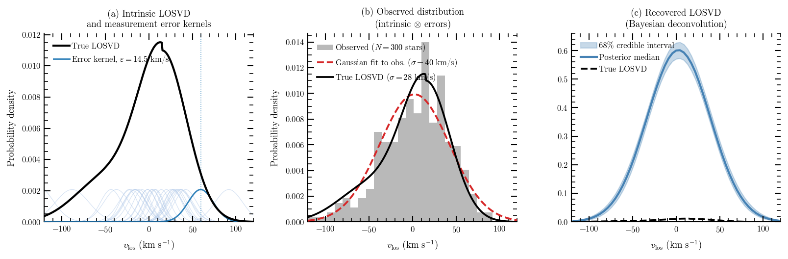
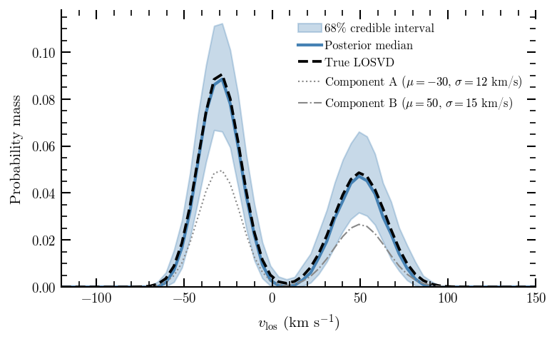
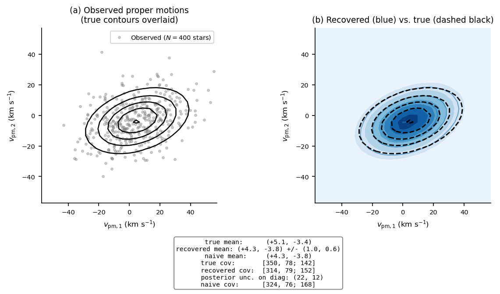
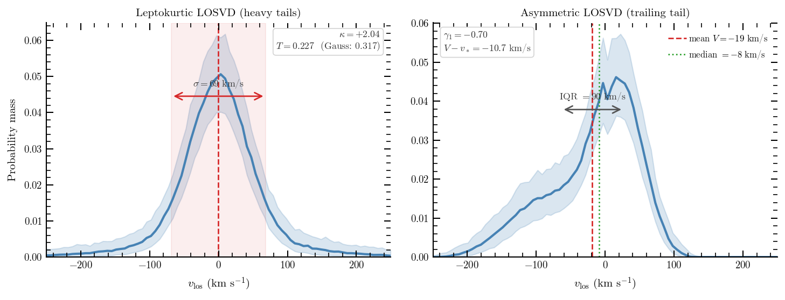
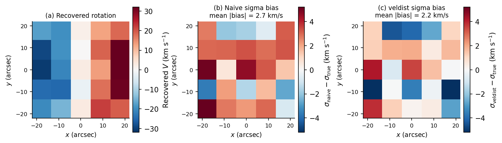

# Examples

## Example 1: Single-bin LOSVD inference

The simplest use case is a single spatial bin containing $N$ stars with
individual velocity measurements and uncertainties.



*(a) The intrinsic LOSVD together with a sample of individual per-star error
kernels. (b) The observed velocity distribution, the convolution of the
intrinsic LOSVD with those error kernels, which is all that is directly
measured. (c) The posterior LOSVD recovered by `veldist`, compared against
the true intrinsic distribution from panel (a).*

**Naive comparison.** Panel (b) overlays the naive approach: a single
Gaussian fit to the raw observed velocities. Its $\sigma=27$ km/s is close
to the true $\sigma=28$ km/s (the second moment is only mildly sensitive to
this much error), but a single Gaussian has no way to represent two
components at all; it just fits *through* the gap between them. `veldist`'s
histogram representation has no such shape restriction, which is why panel
(c) recovers both peaks rather than a single blurred one.

```python
import numpy as np
from veldist import KinematicSolver

rng = np.random.default_rng(42)

# Intrinsic LOSVD: Gaussian with V = 0, σ = 20 km/s
n_stars = 200
v_int = rng.normal(0.0, 20.0, n_stars)

# Per-star measurement errors, drawn from a realistic range
errors = rng.uniform(5.0, 15.0, n_stars)
v_obs = v_int + rng.normal(0.0, errors)

# Set up the velocity grid and run inference
solver = KinematicSolver()
solver.setup_grid(center=0.0, width=200.0, n_bins=50)
solver.add_data(vel=v_obs, err=errors)
solver.run(num_warmup=500, num_samples=3000, gpu=False)

solver.plot_result()
```

`run()` samples 4 chains with a dense mass matrix and
`target_accept_prob=0.95`. Those defaults are measured rather than inherited:
the deviation scale sits in a funnel that NumPyro's default step size cannot
traverse, and a diagonal mass matrix cannot represent the correlations between
neighbouring bins. See {doc}`validation` for the numbers. Call
`veldist.set_host_devices(4)` before any other JAX work to run the chains in
parallel; without it they run sequentially, at about 4x the wall time and with
identical results.

The grid should comfortably enclose the data ($\pm 3\sigma_\mathrm{obs}$ is
a reasonable starting point) and the bin width $\Delta v = \mathrm{width} /
n\_\mathrm{bins}$ should be comparable to the typical measurement uncertainty.
Making $\Delta v$ much smaller than $\varepsilon_\mathrm{typ}$ adds bins that
the data cannot resolve; the prior will fill them in, but the posterior will
be correspondingly wider.

### Recovering a non-Gaussian LOSVD

The same setup applies for non-Gaussian distributions.  Here we use a
double-peaked LOSVD, as might arise from a counter-rotating component or a
contaminating background population:

```python
# Two-component LOSVD: prograde and retrograde populations
n1, n2 = 150, 100
v_int = np.concatenate([
    rng.normal(-30.0, 12.0, n1),   # prograde component
    rng.normal(+50.0, 15.0, n2),   # secondary component
])
errors = rng.uniform(8.0, 18.0, n1 + n2)
v_obs = v_int + rng.normal(0.0, errors)

solver = KinematicSolver()
solver.setup_grid(center=10.0, width=250.0, n_bins=60)
solver.add_data(vel=v_obs, err=errors)
solver.run(num_warmup=500, num_samples=3000, gpu=False)

solver.plot_result()
```

A Gauss-Hermite fit would assign anomalously large $h_3$ or $h_4$ values to
such a distribution; the histogram representation captures both peaks directly.
The `bimodality_score` returned by `compute_summary` will be $\geq 2$ for
bins where this structure is supported by the data.



*Posterior median (solid) with 68% credible interval (shaded) for the
two-component example above.  The dashed line is the true intrinsic
distribution.  Bins where the uncertainty interval is wide are those
poorly constrained by the data; the prior keeps them smooth rather than
noisy.*

> **Note:** this figure is a schematic: the posterior band is a Dirichlet
> draw around the true PMF (`docs/fig_bimodal.py`), not a real
> `KinematicSolver` run, so it illustrates the expected *shape* of a
> two-component recovery without the runtime of live inference. See
> `fig_deconvolution.py` above for a figure generated from an actual run.

---

## Example 2: Batch inference and Dynamite output

For IFU-style data where stellar velocities have been Voronoi-binned, use
`fit_all_bins` to run inference across all bins and `write_dynamite_kinematics`
to produce the three files expected by Dynamite's `BayesLOSVD` kinematics
handler.

### Preparing the input

`fit_all_bins` expects a list of dicts, one per Voronoi bin:

```python
# bin_data_list[i] = {'vel': array, 'err': array} for bin i
# Bins with fewer than min_stars stars are skipped and returned as None.
bin_data_list = [
    {'vel': bin_velocities[i], 'err': bin_errors[i]}
    for i in range(n_bins)
]
```

### Running the batch pipeline

```python
from veldist import fit_all_bins, write_dynamite_kinematics

solvers = fit_all_bins(
    bin_data_list,
    grid_kwargs={"center": 0.0, "width": 600.0, "n_bins": 60},
    run_kwargs={"num_warmup": 500, "num_samples": 3000, "gpu": False, "seed": 5567},
    min_stars=10,
)
```

`fit_all_bins` uses `seed + bin_index` internally so that the chains for
different bins are independent.  Bins with fewer than `min_stars` stars are
returned as `None` and masked automatically in the output files.

#### Matched-grid fitting for narrow-dispersion bins

The shared velocity grid must hold the widest LOSVD in the field, so bins with
a small dispersion spend most of their bins empty: at $\sigma = 7$ km/s on a
grid sized for $\sigma = 22$, only ~30% of bins carry any mass, and the prior
has to explain the rest. Coverage collapses there.

Dynamite's one-grid requirement applies to the *output*, not to the inference.
Passing an `ObservingProfile` as `match_grid` fits each bin on a grid sized to
its own dispersion, then aggregates every posterior sample onto the shared
output grid before the summary is taken:

```python
from veldist.calibration import OMEGACAT

solvers = fit_all_bins(
    bin_data_list,
    grid_kwargs={"center": 0.0, "width": 600.0, "n_bins": 60},
    match_grid=OMEGACAT,
)
```

The aggregation is exact, being a sum of probability mass within output bins
taken per posterior sample, so uncertainties propagate correctly. It requires
each fitted bin to lie entirely within one output bin, which the function
checks and raises on rather than approximating. The grid inference actually ran
on is kept as `solver.fitted_grid`; `solver.grid` describes the shared output
grid, so downstream code and the Dynamite writer need no changes.

Default is `None`, which fits every bin on the shared grid as before.

### Writing Dynamite input files

```python
# voronoi_bin_metadata describes the spatial layout of the IFU mosaic.
# See write_dynamite_kinematics docstring for the full required structure.

write_dynamite_kinematics(
    solvers=solvers,
    output_dir="dynamite_input",
    voronoi_bin_metadata=voronoi_bin_metadata,
    bin_flux_mode="nstars",   # use N_stars as the bin flux proxy
)
```

This writes three files to `dynamite_input/`:

- `bayes_losvd_kins.ecsv`: one row per solved bin, with interleaved
  `losvd_j` / `dlosvd_j` columns matching the BayesLOSVD ECSV format.
  The `dlosvd_j` values are half-widths of the 68% credible interval,
  consistent with the convention used by Falcón-Barroso & Martig (2021).
- `aperture.dat`: pixel grid geometry for Dynamite.
- `bins.dat`: pixel-to-bin mapping; skipped bins are written as 0.

The `bin_flux` column receives `solver.n_stars` for each bin when
`bin_flux_mode='nstars'`.  This is the natural discrete-data analogue of IFU
surface brightness.  Note that `bin_flux` is used only for flux-weighted
systemic velocity centering (`center_v_systemic`) in Dynamite and does not
enter the NNLS chi-squared.

### Optional post-processing

`clip_uncertainties()` is called automatically inside `fit_all_bins` and
enforces a floor on `dlosvd` values to prevent zero-uncertainty entries in
the ECSV, which would corrupt Dynamite's matrix inversion.

`truncate_losvd()` is available as an optional step for bins where significant
probability mass has accumulated in edge bins that are not supported by the
data (typically a sign that the grid is too wide or that the bin has very few
stars).  It is not applied by default.

```python
# Inspect a specific bin for tail contamination before deciding
solver = solvers[i]
solver.plot_result()

# Apply truncation only if clearly warranted
solver.truncate_losvd(n_sigma=3.0)
```

---

## Example 2b: 2D (proper-motion) inference

For proper-motion data, two correlated velocity components per star, each
with its own measurement covariance, use `KinematicSolver2D` from
`veldist.veldist2d`. **It is not re-exported from the top-level `veldist`
package**, unlike `KinematicSolver`, so import it from the submodule
directly:



*(a) Observed proper motions for a correlated, anisotropic true
distribution (`HST_FAINT`'s calibrated errors and star count), with the
true density contoured. (b) The posterior median recovered by
`KinematicSolver2D` (colour), with the true density overlaid as dashed
contours: the recovery correctly picks up both the tilt (the
$v_{\mathrm{pm},1}$/$v_{\mathrm{pm},2}$ correlation) and the anisotropy
(different widths along each axis). The annotated box compares the
recovered posterior mean/covariance (with its own posterior uncertainty)
against a naive estimate: the sample mean/covariance of the observed data
with no deconvolution, which is also what a plain 2D KDE's first and
second moments would give you.*

**Does this beat the naive estimate?** On this single draw: the mean is a
wash (naive is unbiased here too, since measurement error is zero-mean),
`veldist` recovers $\sigma_y$ noticeably better (bias ~10 km/s vs ~27 for
naive), but on $\sigma_x$ the naive estimate happened to do slightly
better on this particular realization, well within `veldist`'s own
posterior uncertainty on that entry. A single draw at $N=400$ is not
strong evidence either way; the rigorous comparison is
`test_per_cell_losvd_coverage_2d` in `validation.md`, which checks
whether the *credible intervals* contain the truth at their nominal rate
over many realizations, not just whether one point estimate happens to be
closer. That is also the naive estimator's real weakness: it has no
uncertainty at all to be calibrated, so there's no way to know from a
naive fit alone whether a given bin's estimate is trustworthy. Using
`HST_BRIGHT` here instead (its real calibrated err/sigma ~0.014, per
`calibration2d.py`) would make both approaches agree almost exactly,
because there is very little measurement error left to deconvolve; an
earlier version of this figure used an invented, uncalibrated error scale
that was ~30x too large, which produced a misleadingly bad-looking
recovery unrelated to any real regime.

```python
import numpy as np
import veldist
from veldist.veldist2d import KinematicSolver2D
from veldist.calibration2d import HST_BRIGHT  # or HST_FAINT, GAIA_OUTER

veldist.set_host_devices(4)

profile = HST_BRIGHT  # calibrated grid width/n_bins for this observing regime

# pm1, pm2: observed proper-motion components (km/s or mas/yr, consistent
# with cov). cov: per-star (2, 2) measurement covariance, NOT a correlation
# coefficient; see KinematicSolver2D.add_data for the rho -> cov conversion.
solver = KinematicSolver2D()
solver.setup_grid(
    center=(0.0, 0.0),
    width=(profile.grid_width, profile.grid_width),
    n_bins=profile.n_bins,
)
solver.add_data(pm1=pm1, pm2=pm2, cov=cov)
solver.run(num_warmup=500, num_samples=3000, gpu=False)
```

`calibration2d.py` provides three calibrated `ObservingProfile2D` instances
(`HST_BRIGHT`, `HST_FAINT`, `GAIA_OUTER`) that derive the grid width and cell
count from the proper-motion measurement regime, the same role
`calibration.py`'s `OMEGACAT` plays for 1D; see `validation.md` for how
`cell_per_sigma` was chosen. `run()` defaults to `num_samples=3000` (not
1000): measured on real HST data, ESS on the six scalar sites roughly
tripled from 1000 to 3000 samples at effectively the same wall time, since
per-bin runtime is dominated by JIT compilation, not sampling.

The batch/export path mirrors 1D: `fit_all_bins_2d` (from
`veldist.veldist2d`) runs `KinematicSolver2D` across a list of Voronoi bins,
and `write_dynamite_kinematics_2d` (from `veldist.dynamite2d`) writes
Dynamite's `ProperMotions`/`Histogram2D` input, a `.npz` archive
(`PM_2dhist`, `PM_2dhist_sigma`, plus bin metadata) alongside the usual
`aperture.dat`/`bins.dat` pair. Bins are independent, so `fit_all_bins_2d`
accepts `n_jobs` to fit several concurrently via `ProcessPoolExecutor`
(default `n_jobs=1`, sequential):

```python
from veldist.veldist2d import fit_all_bins_2d
from veldist.dynamite2d import write_dynamite_kinematics_2d

solvers = fit_all_bins_2d(
    bin_data_list,  # [{'pm1': ..., 'pm2': ..., 'cov': ...}, ...]
    grid_kwargs={"center": (0.0, 0.0), "width": (profile.grid_width,) * 2, "n_bins": profile.n_bins},
    run_kwargs={"num_warmup": 500, "num_samples": 3000, "gpu": False},
    min_stars=10,
    n_jobs=4,  # fit bins concurrently via ProcessPoolExecutor; default is 1 (sequential)
)

write_dynamite_kinematics_2d(
    solvers=solvers,
    output_dir="dynamite_input_2d",
    voronoi_bin_metadata=voronoi_bin_metadata,
)
```

`n_bins` must be odd: DYNAMITE's `ProperMotions` reader raises on even
counts, which is why `ObservingProfile2D.n_bins` always rounds up to the
nearest odd value. See `TASKS.md` for what's still open on the 2D path
(PM-axis marginalisation, 3D) and `validation.md` for the 2D SBC/coverage
numbers.

---

## Example 3: Kinematic summary maps

Once the batch pipeline has run, `compute_summary_maps` extracts
spatially-mappable scalar summaries from the posterior samples, analogous to
the $V$, $\sigma$, $h_3$, $h_4$ maps produced by Gauss-Hermite fitting.

```python
from veldist.analysis import compute_summary_maps

maps = compute_summary_maps(solvers)
```

`maps` is a dict with one entry per metric; each entry contains `'median'`
and `'uncertainty'` arrays of length `n_bins`, with `NaN` for skipped bins.

### Plotting kinematic maps

```python
import matplotlib.pyplot as plt
import matplotlib.colors as mcolors

xbin = np.array([meta['xbin'] for meta in voronoi_bin_metadata['bins']])
ybin = np.array([meta['ybin'] for meta in voronoi_bin_metadata['bins']])

metrics = [
    ('v_mean',    'Mean velocity (km s$^{-1}$)',     'RdBu_r'),
    ('sigma',     'Dispersion (km s$^{-1}$)',         'viridis'),
    ('skewness',  'Skewness $\\gamma_1$',             'PuOr'),
    ('kurtosis',  'Excess kurtosis $\\kappa$',        'PuOr'),
]

fig, axes = plt.subplots(1, 4, figsize=(16, 4))
for ax, (key, label, cmap) in zip(axes, metrics):
    vals = maps[key]['median']
    vmax = np.nanpercentile(np.abs(vals), 95)
    norm = mcolors.TwoSlopeNorm(vcenter=0, vmin=-vmax, vmax=vmax) \
           if cmap == 'RdBu_r' or cmap == 'PuOr' else None
    sc = ax.scatter(xbin, ybin, c=vals, cmap=cmap, norm=norm, s=30)
    plt.colorbar(sc, ax=ax, label=label)
    ax.set_aspect('equal')
    ax.set_xlabel('x (arcsec)')
    ax.set_ylabel('y (arcsec)')
fig.tight_layout()
```

### Relationship to Gauss-Hermite moments

The moment-based metrics from `compute_summary` are related to the
Gauss-Hermite coefficients by the following approximate conversions, valid
for $|h_3|, |h_4| \lesssim 0.2$:

$$
h_3 \approx -\frac{\gamma_1}{\sqrt{6}}, \qquad h_4 \approx \frac{\kappa}{\sqrt{24}}
$$

These allow direct cross-comparison with GH-based Dynamite models and
with published kinematic maps from IFU surveys.  Note the sign: $\gamma_1 > 0$
(a trailing low-velocity tail) corresponds to $h_3 < 0$, which is the
expected pattern on the receding side of a rotating system.

The `tail_weight` metric and the `bimodality_score` have no GH analogues
and are diagnostic of features that GH fitting cannot represent, such as heavy tails
in the radially-anisotropic regime and bimodal LOSVDs from
kinematically distinct populations.

> **Kurtosis bias note:** The default smoothness prior
> (`prior="gaussian_core"`) does not produce the kurtosis or velocity-
> dispersion biases of the original RW1 prior. Kurtosis bias for a Gaussian
> truth is 0.00; sigma bias is within 3%. When using `prior="rw1"`, the
> known kurtosis bias (roughly +1.1 in excess-kurtosis units, growing with
> bin count) can be partially mitigated with `compute_summary(...,
> n_sigma_truncate=3.0)`. See `validation.md` for the full numbers.



*Left: a symmetric, leptokurtic LOSVD (heavy tails, a radial-anisotropy
analogue) with its scalar summary metrics annotated. Right: an asymmetric,
skewed LOSVD (a rotation-like analogue). Compare the sign and magnitude of
`skewness`/`kurtosis` against the shapes shown here when interpreting a new
fit.*



*(a) Recovered rotation $V$ across a synthetic 5x5-bin cluster with a
solid-body rotating core, correctly showing the antisymmetric pattern.
(b, c) Since this is synthetic data with a known true $\sigma(r)$, the
naive (no-deconvolution) sample $\sigma$ bias and `veldist`'s deconvolved
$\sigma$ bias are plotted on the same colour scale. `veldist` reduces mean
|bias| from 2.7 to 2.2 km/s here; skewness/kurtosis maps are not shown,
since they are not part of the method's documented acceptance criterion
(`v_mean`/`sigma` well-calibrated; `h3`/`h4` not required) and a map of
unreliable values would not be a fair demonstration.*

---

## Which shape statistic should I use?

Three sets of shape numbers are available, and they answer different questions.

| Function | Gives | Use when |
| --- | --- | --- |
| `compute_summary` | `skewness`, `kurtosis` (ordinary standardised moments) | You want the moments themselves. Sensitive to a few stars in the tails. |
| `compute_percentile_summary` | `skew_pct` (Bowley), `kurtosis_pct` (excess Moors) | You want robustness. A single outlier moves these by at most one bin width. |
| `gauss_hermite_fit` | `h3`, `h4` | You need numbers comparable to the dynamical-modelling literature. |

They are not interchangeable and will not agree numerically. `skew_pct` and
`h3` have the same sign convention and are monotonically related, but the
mapping between them depends on the LOSVD shape; `calibration.PROXY_TO_GH`
records the measured relation for this project's mocks.

    from veldist import compute_percentile_summary, gauss_hermite_fit

    pct = compute_percentile_summary(solver.samples["intrinsic_pdf"], solver.grid["centers"])
    gh = gauss_hermite_fit(solver.samples["intrinsic_pdf"], solver.grid["centers"])
    print(f"Bowley skew {pct['skew_pct'][0]:+.3f} +/- {pct['skew_pct'][1]:.3f}")
    print(f"GH h3       {gh['h3'][0]:+.3f} +/- {gh['h3'][1]:.3f}")
