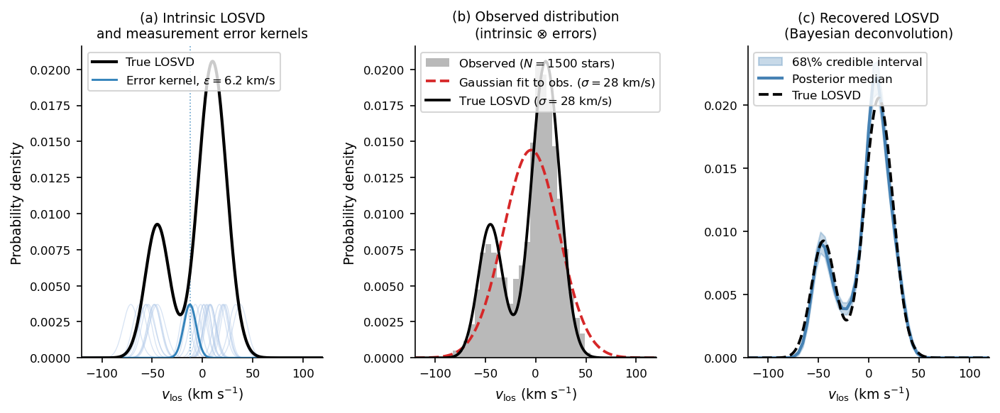
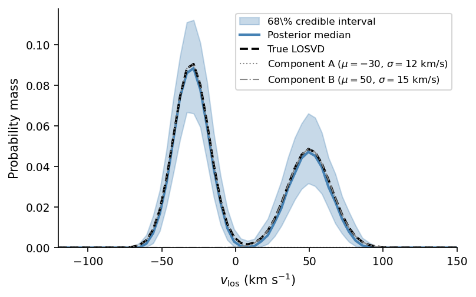
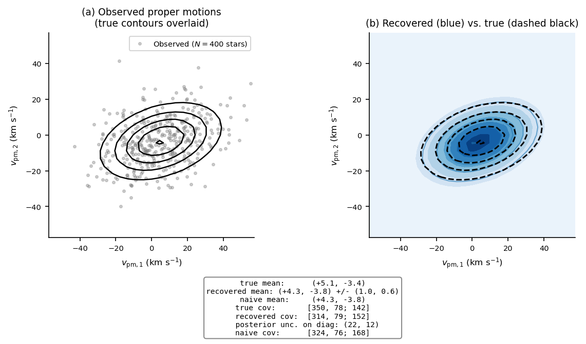
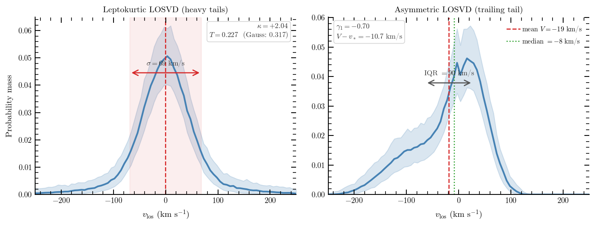
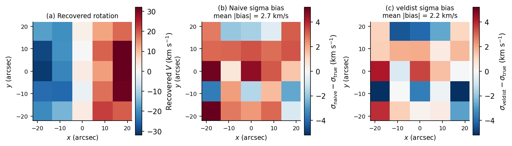

# Examples

## Example 1: Single-bin LOSVD inference

The simplest case is one spatial bin holding $N$ stars, each with a measured
velocity and uncertainty.



*(a) The intrinsic LOSVD and a sample of per-star error kernels. (b) The
observed velocity distribution, which is the intrinsic LOSVD convolved with
those kernels and is all we actually measure. (c) The posterior LOSVD from
`veldist`, compared with the truth from panel (a).*

Panel (b) also shows the naive approach, a single Gaussian fitted to the raw
velocities. Its $\sigma = 27$ km/s is close to the true 28 km/s, since the
second moment is not very sensitive to this level of error. But a single
Gaussian cannot represent two components, so it fits straight through the
gap between them. The histogram in panel (c) has no such restriction and
recovers both peaks.

```python
import numpy as np
from veldist import KinematicSolver

rng = np.random.default_rng(42)

# Intrinsic LOSVD: Gaussian with V = 0, σ = 20 km/s
n_stars = 200
v_int = rng.normal(0.0, 20.0, n_stars)

# Per-star measurement errors, drawn from a realistic range
errors = rng.uniform(5.0, 15.0, n_stars)
v_obs = v_int + rng.normal(0.0, errors)

# Set up the velocity grid and run inference
solver = KinematicSolver()
solver.setup_grid(center=0.0, width=200.0, n_bins=50)
solver.add_data(vel=v_obs, err=errors)
solver.run(num_warmup=500, num_samples=3000, gpu=False)

solver.plot_result()
```

By default `run()` samples 4 chains with a dense mass matrix and
`target_accept_prob=0.95`. These settings were chosen by measurement. The
deviation scale sits in a funnel that NumPyro's default step size cannot
cross, and a diagonal mass matrix cannot capture the correlations between
neighbouring bins; {doc}`validation` has the numbers. Call
`veldist.set_host_devices(4)` before any other JAX work to run the chains in
parallel. Without it they run one after another: the results are the same,
but it takes about four times as long.

The grid should comfortably cover the data ($\pm 3\sigma_\mathrm{obs}$ is a
reasonable start), and the bin width $\Delta v = \mathrm{width} /
n\_\mathrm{bins}$ should be similar to the typical measurement error. Bins
much narrower than $\varepsilon_\mathrm{typ}$ cannot be resolved by the data.
The prior fills them in, but the posterior gets wider.

### Recovering a non-Gaussian LOSVD

Non-Gaussian distributions need no special setup. Here is a double-peaked
LOSVD, like one produced by a counter-rotating component or a background
population:

```python
# Two-component LOSVD: prograde and retrograde populations
n1, n2 = 150, 100
v_int = np.concatenate([
    rng.normal(-30.0, 12.0, n1),   # prograde component
    rng.normal(+50.0, 15.0, n2),   # secondary component
])
errors = rng.uniform(8.0, 18.0, n1 + n2)
v_obs = v_int + rng.normal(0.0, errors)

solver = KinematicSolver()
solver.setup_grid(center=10.0, width=250.0, n_bins=60)
solver.add_data(vel=v_obs, err=errors)
solver.run(num_warmup=500, num_samples=3000, gpu=False)

solver.plot_result()
```

A Gauss-Hermite fit would describe this with unusually large $h_3$ or $h_4$.
The histogram simply shows both peaks. When the data support two peaks, the
`bimodality_score` from `compute_summary` is $\geq 2$.



*Posterior median (solid) and 68% credible interval (shaded) for the example
above; the dashed line is the true distribution. Where the data constrain a
bin poorly, the interval is wide and the prior keeps the curve smooth.*

> **Note:** this figure is schematic. The band is a Dirichlet draw around the
> true distribution (`docs/fig_bimodal.py`), not a real `KinematicSolver`
> run. It shows what a two-component recovery looks like without the cost of
> running inference. The deconvolution figure at the top of this page comes
> from a real run.

---

## Example 2: Batch inference and Dynamite output

For IFU-style data with Voronoi-binned stellar velocities, `fit_all_bins`
runs inference on every bin, and `write_dynamite_kinematics` writes the three
files Dynamite's `BayesLOSVD` kinematics handler reads.

### Preparing the input

`fit_all_bins` takes a list of dicts, one per Voronoi bin:

```python
# bin_data_list[i] = {'vel': array, 'err': array} for bin i
# Bins with fewer than min_stars stars are skipped and returned as None.
bin_data_list = [
    {'vel': bin_velocities[i], 'err': bin_errors[i]}
    for i in range(n_bins)
]
```

### Running the batch pipeline

```python
from veldist import fit_all_bins, write_dynamite_kinematics

solvers = fit_all_bins(
    bin_data_list,
    grid_kwargs={"center": 0.0, "width": 600.0, "n_bins": 60},
    run_kwargs={"num_warmup": 500, "num_samples": 3000, "gpu": False, "seed": 5567},
    min_stars=10,
)
```

Each bin is seeded with `seed + bin_index`, so the chains for different bins
are independent. Bins with fewer than `min_stars` stars come back as `None`
and are masked in the output files.

#### Matched grids for narrow-dispersion bins

The shared velocity grid has to fit the widest LOSVD in the field, so a bin
with a small dispersion leaves most of the grid empty. At $\sigma = 7$ km/s
on a grid sized for $\sigma = 22$, only about 30% of the bins hold any mass,
the prior has to account for the rest, and coverage falls apart.

Dynamite needs a single grid for its *input*, not for the inference. Pass an
`ObservingProfile` as `match_grid` and each bin is fitted on a grid sized to
its own dispersion. Every posterior sample is then summed onto the shared
output grid before the summary is taken:

```python
from veldist.calibration import OMEGACAT

solvers = fit_all_bins(
    bin_data_list,
    grid_kwargs={"center": 0.0, "width": 600.0, "n_bins": 60},
    match_grid=OMEGACAT,
)
```

Because the mass is summed sample by sample, the uncertainties carry over
exactly. This requires each fitted bin to lie entirely inside one output
bin; if it does not, the function raises an error rather than approximating.
The grid actually used for the fit is kept in `solver.fitted_grid`, while
`solver.grid` describes the shared output grid, so downstream code and the
Dynamite writer work unchanged.

The default, `match_grid=None`, fits every bin on the shared grid.

### Writing Dynamite input files

```python
# voronoi_bin_metadata describes the spatial layout of the IFU mosaic.
# See write_dynamite_kinematics docstring for the full required structure.

write_dynamite_kinematics(
    solvers=solvers,
    output_dir="dynamite_input",
    voronoi_bin_metadata=voronoi_bin_metadata,
    bin_flux_mode="nstars",   # use N_stars as the bin flux proxy
)
```

This writes three files to `dynamite_input/`:

- `bayes_losvd_kins.ecsv`: one row per fitted bin, with alternating
  `losvd_j` / `dlosvd_j` columns in the BayesLOSVD ECSV format. `dlosvd_j`
  is the half-width of the 68% credible interval, following Falcón-Barroso &
  Martig (2021).
- `aperture.dat`: the pixel grid geometry.
- `bins.dat`: the pixel-to-bin map, with skipped bins written as 0.

With `bin_flux_mode='nstars'`, the `bin_flux` column is `solver.n_stars`,
the discrete-data counterpart of IFU surface brightness. Dynamite uses
`bin_flux` only to flux-weight the systemic velocity (`center_v_systemic`);
it does not enter the NNLS chi-squared.

### Optional post-processing

`fit_all_bins` calls `clip_uncertainties()` automatically. It puts a floor
under the `dlosvd` values, because a zero uncertainty in the ECSV breaks
Dynamite's matrix inversion.

`truncate_losvd()` is an optional repair for bins where a noticeable amount
of mass has piled up in edge bins without support from the data. This
usually means the grid is too wide or the bin has very few stars. It is not
applied by default.

```python
# Inspect a specific bin for tail contamination before deciding
solver = solvers[i]
solver.plot_result()

# Apply truncation only if clearly warranted
solver.truncate_losvd(n_sigma=3.0)
```

---

## Example 2b: 2D (proper-motion) inference

Proper motions give two correlated velocity components per star, each star
with its own measurement covariance. Use `KinematicSolver2D` for these.
**It is not exported from the top-level `veldist` package**, so import it
from `veldist.veldist2d`.



*(a) Observed proper motions for a tilted, anisotropic true distribution,
using `HST_FAINT`'s calibrated errors and star count, with the true density
contoured. (b) The posterior median from `KinematicSolver2D` (colour) with
the true density as dashed contours. The recovery gets both the tilt (the
correlation between $v_{\mathrm{pm},1}$ and $v_{\mathrm{pm},2}$) and the
different widths along each axis. The inset compares the posterior mean and
covariance, with their uncertainties, against the sample mean and covariance
of the raw data. That naive estimate is also what the first two moments of a
plain 2D KDE would give.*

Does `veldist` beat the naive estimate here? For the mean it is a draw: the
measurement errors have zero mean, so the naive mean is unbiased too.
`veldist` recovers $\sigma_y$ clearly better (a bias of about 10 km/s against
27 km/s), while on $\sigma_x$ the naive estimate happens to be slightly
closer for this realisation, well within `veldist`'s own uncertainty. One
draw at $N = 400$ proves little either way. The real test is
`test_per_cell_losvd_coverage_2d` (see {doc}`validation`), which checks over
many realisations that the credible intervals contain the truth at the
nominal rate. This is where the naive estimate falls short: it comes with no
uncertainty at all, so there is no way to tell whether a given bin can be
trusted. With `HST_BRIGHT` instead (calibrated error-to-dispersion ratio of
about 0.014), the two approaches agree almost exactly, because there is very
little error left to deconvolve.

```python
import numpy as np
import veldist
from veldist.veldist2d import KinematicSolver2D
from veldist.calibration2d import HST_BRIGHT  # or HST_FAINT, GAIA_OUTER

veldist.set_host_devices(4)

profile = HST_BRIGHT  # calibrated grid width/n_bins for this observing regime

# pm1, pm2: observed proper-motion components (km/s or mas/yr, consistent
# with cov). cov: per-star (2, 2) measurement covariance, NOT a correlation
# coefficient; see KinematicSolver2D.add_data for the rho -> cov conversion.
solver = KinematicSolver2D()
solver.setup_grid(
    center=(0.0, 0.0),
    width=(profile.grid_width, profile.grid_width),
    n_bins=profile.n_bins,
)
solver.add_data(pm1=pm1, pm2=pm2, cov=cov)
solver.run(num_warmup=500, num_samples=3000, gpu=False)
```

`calibration2d.py` provides three calibrated `ObservingProfile2D` instances,
`HST_BRIGHT`, `HST_FAINT` and `GAIA_OUTER`. Each sets the grid width and
cell count from the measurement regime, as `OMEGACAT` does in 1D;
{doc}`validation` explains how `cell_per_sigma` was chosen. `run()` defaults
to `num_samples=3000`. On real HST data, going from 1000 to 3000 samples
roughly tripled the effective sample size of the six scalar parameters at
almost no extra wall time, because per-bin runtime is dominated by JIT
compilation rather than sampling.

The batch and export path mirrors 1D. `fit_all_bins_2d` (in
`veldist.veldist2d`) fits `KinematicSolver2D` to a list of Voronoi bins, and
`write_dynamite_kinematics_2d` (in `veldist.dynamite2d`) writes Dynamite's
`ProperMotions`/`Histogram2D` input: a `.npz` archive (`PM_2dhist`,
`PM_2dhist_sigma` and bin metadata) plus the usual `aperture.dat` and
`bins.dat`. Bins are independent, so `n_jobs` can fit several at once in a
`ProcessPoolExecutor` (the default, `n_jobs=1`, runs them in sequence):

```python
from veldist.veldist2d import fit_all_bins_2d
from veldist.dynamite2d import write_dynamite_kinematics_2d

solvers = fit_all_bins_2d(
    bin_data_list,  # [{'pm1': ..., 'pm2': ..., 'cov': ...}, ...]
    grid_kwargs={"center": (0.0, 0.0), "width": (profile.grid_width,) * 2, "n_bins": profile.n_bins},
    run_kwargs={"num_warmup": 500, "num_samples": 3000, "gpu": False},
    min_stars=10,
    n_jobs=4,  # fit bins concurrently via ProcessPoolExecutor; default is 1 (sequential)
)

write_dynamite_kinematics_2d(
    solvers=solvers,
    output_dir="dynamite_input_2d",
    voronoi_bin_metadata=voronoi_bin_metadata,
)
```

`n_bins` must be odd, because Dynamite's `ProperMotions` reader rejects even
counts; `ObservingProfile2D.n_bins` always rounds up to an odd number.
{doc}`validation` has the 2D calibration and coverage results.

---

## Example 3: Kinematic summary maps

After the batch run, `compute_summary_maps` turns the posterior samples into
scalar summaries per bin, the counterpart of the $V$, $\sigma$, $h_3$, $h_4$
maps from Gauss-Hermite fitting.

```python
from veldist.analysis import compute_summary_maps

maps = compute_summary_maps(solvers)
```

`maps` has one entry per metric. Each entry holds `'median'` and
`'uncertainty'` arrays of length `n_bins`, with `NaN` for skipped bins.

### Plotting kinematic maps

```python
import matplotlib.pyplot as plt
import matplotlib.colors as mcolors

xbin = np.array([meta['xbin'] for meta in voronoi_bin_metadata['bins']])
ybin = np.array([meta['ybin'] for meta in voronoi_bin_metadata['bins']])

metrics = [
    ('v_mean',    'Mean velocity (km s$^{-1}$)',     'RdBu_r'),
    ('sigma',     'Dispersion (km s$^{-1}$)',         'viridis'),
    ('skewness',  'Skewness $\\gamma_1$',             'PuOr'),
    ('kurtosis',  'Excess kurtosis $\\kappa$',        'PuOr'),
]

fig, axes = plt.subplots(1, 4, figsize=(16, 4))
for ax, (key, label, cmap) in zip(axes, metrics):
    vals = maps[key]['median']
    vmax = np.nanpercentile(np.abs(vals), 95)
    norm = mcolors.TwoSlopeNorm(vcenter=0, vmin=-vmax, vmax=vmax) \
           if cmap == 'RdBu_r' or cmap == 'PuOr' else None
    sc = ax.scatter(xbin, ybin, c=vals, cmap=cmap, norm=norm, s=30)
    plt.colorbar(sc, ax=ax, label=label)
    ax.set_aspect('equal')
    ax.set_xlabel('x (arcsec)')
    ax.set_ylabel('y (arcsec)')
fig.tight_layout()
```

### Relationship to Gauss-Hermite moments

For $|h_3|, |h_4| \lesssim 0.2$, the moments from `compute_summary` relate
to the Gauss-Hermite coefficients approximately as

$$
h_3 \approx -\frac{\gamma_1}{\sqrt{6}}, \qquad h_4 \approx \frac{\kappa}{\sqrt{24}}
$$

which allows a rough comparison with GH-based Dynamite models and published
IFU maps. Note the sign: $\gamma_1 > 0$ (a tail toward high velocities)
corresponds to $h_3 < 0$.

`tail_weight` and `bimodality_score` have no GH counterpart. They flag
features GH fitting cannot represent, such as the heavy tails of a radially
anisotropic system or the two peaks of kinematically distinct populations.

> **Kurtosis bias:** the default prior (`prior="gaussian_core"`) does not
> have the kurtosis and dispersion biases of the older RW1 prior. For a
> Gaussian truth the kurtosis bias is 0.00 and the dispersion bias is within
> 3%. With `prior="rw1"` the kurtosis bias is about +1.1 and grows with the
> number of bins; `compute_summary(..., n_sigma_truncate=3.0)` reduces it
> somewhat. See {doc}`validation` for details.



*Left: a symmetric LOSVD with heavy tails, as from radial anisotropy, with
its summary metrics. Right: a skewed LOSVD, as from rotation. Use these as a
reference for the sign and size of `skewness` and `kurtosis` when reading a
new fit.*



*(a) Recovered rotation $V$ across a synthetic 5x5-bin cluster with a
solid-body rotating core, showing the expected antisymmetric pattern.
(b, c) The true $\sigma(r)$ is known, so the dispersion bias of the naive
sample estimate and of `veldist` can be shown on the same colour scale.
`veldist` reduces the mean absolute bias from 2.7 to 2.2 km/s. Skewness and
kurtosis maps are left out: the method only claims well-calibrated `v_mean`
and `sigma`, and a map of unreliable higher moments would be misleading.*

---

## Which shape statistic should I use?

There are three families of shape statistics, and each answers a different
question.

| Function | Gives | Use when |
| --- | --- | --- |
| `compute_summary` | `skewness`, `kurtosis` (ordinary standardised moments) | You want the moments themselves. Sensitive to a few stars in the tails. |
| `compute_percentile_summary` | `skew_pct` (Bowley), `kurtosis_pct` (excess Moors) | You want robustness. A single outlier moves these by at most one bin width. |
| `gauss_hermite_fit` | `h3`, `h4` | You need numbers comparable to the dynamical-modelling literature. |

They are not interchangeable and will not agree numerically. `skew_pct` and
`h3` share a sign convention and move together, but the exact relation
depends on the LOSVD shape. `calibration.PROXY_TO_GH` records the relation
measured on this project's mocks.

    from veldist import compute_percentile_summary, gauss_hermite_fit

    pct = compute_percentile_summary(solver.samples["intrinsic_pdf"], solver.grid["centers"])
    gh = gauss_hermite_fit(solver.samples["intrinsic_pdf"], solver.grid["centers"])
    print(f"Bowley skew {pct['skew_pct'][0]:+.3f} +/- {pct['skew_pct'][1]:.3f}")
    print(f"GH h3       {gh['h3'][0]:+.3f} +/- {gh['h3'][1]:.3f}")
