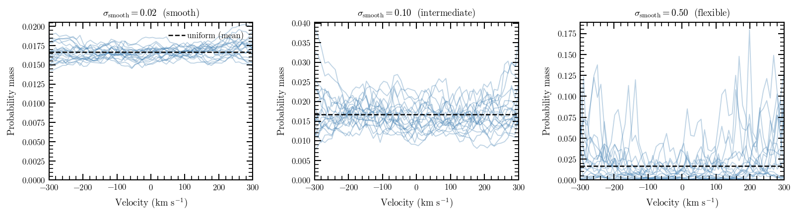
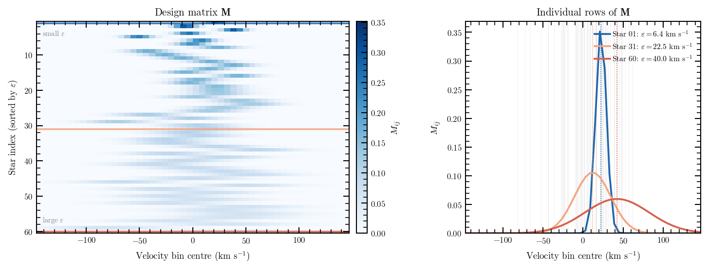

# Methodology

## Overview

`veldist` recovers the intrinsic line-of-sight velocity distribution (LOSVD)
from a discrete set of stellar velocities, each measured with its own
uncertainty.  The approach is non-parametric: rather than assuming the LOSVD
follows a Gaussian or Gauss-Hermite expansion, we solve for the probability
mass in each bin of a fixed velocity histogram.  Regularisation is provided
by a Gaussian random walk prior, whose smoothing scale is treated as a free
hyperparameter and marginalised over during inference.  Measurement errors
enter the likelihood exactly, with no assumptions about their distribution
across stars.

The method is closest in spirit to the penalised-likelihood approach of
Merritt (1997) and Saha & Williams (1994), but replaces the manual smoothing
penalty with a marginalised Bayesian prior and uses MCMC sampling rather than
optimisation.

---

## The Model

### Histogram representation

We represent the intrinsic LOSVD as a vector of probability masses
$\mathbf{w} \in \mathbb{R}^K$ on a fixed velocity grid with $K$ bins,
where $\sum_j w_j = 1$.  The grid is defined by a central velocity, total
width, and number of bins.  The bin width $\Delta v$ is chosen to be
comparable to the typical measurement uncertainty, so that the data can
resolve individual bins.

### Smoothing prior

A flat histogram is not a useful prior for stellar kinematics: real LOSVDs
are smooth.  We impose this by generating the histogram weights through a
latent Gaussian random walk.  The latent variable $u_i$ for bin $i$ is
drawn from a normal distribution centred on the previous bin value:

$$
u_0 \sim \mathcal{N}(0, \sigma_\mathrm{smooth}),
\qquad
u_i \sim \mathcal{N}(u_{i-1},\, \sigma_\mathrm{smooth}), \quad i > 0.
$$

The weight vector $\mathbf{w}$ is then obtained by applying the softmax
transformation to $\mathbf{u}$, which ensures positivity and unit normalisation.

The smoothing scale $\sigma_\mathrm{smooth}$ controls the typical step size
between adjacent bins.  A small value forces the inferred LOSVD to vary
slowly; a large value allows sharp features.  Crucially, $\sigma_\mathrm{smooth}$
is not fixed by the user — it is a free hyperparameter with a weakly
informative prior, and its posterior is marginalised during sampling.  The
sampler therefore adapts the smoothness to the signal-to-noise of the data
automatically: a bin with many stars will support more structure than one
with few.

*Prior realisations at $\sigma_\mathrm{smooth} = 0.02$ (left), $0.1$ (centre), and $0.5$ (right).  Lighter values of $\sigma_\mathrm{smooth}$ enforce smoother LOSVDs; larger values allow the prior to explore more structured shapes.  In practice the sampler marginalises over this parameter.*

---

## The Likelihood: Design Matrix

### The deconvolution problem

The central difficulty is that every star has a different measurement
uncertainty $\varepsilon_i$.  The observed velocity $y_i$ of star $i$ is
drawn from a distribution that is the convolution of the intrinsic LOSVD
with the star's measurement error kernel:

$$
p(y_i \mid \mathbf{w}) = \sum_{j=1}^{K} w_j \,
  \mathcal{N}\!\left(y_i \,\big|\, c_j,\, \varepsilon_i^2\right)
$$

where $c_j$ is the centre of bin $j$.  Evaluating this naïvely for all $N$
stars at every MCMC step is an $O(N K)$ operation that involves $N K$
exponential evaluations — expensive for large samples.

### Pre-computing the design matrix

We avoid this by pre-computing the $N \times K$ **design matrix** $\mathbf{M}$
before inference begins.  Entry $M_{ij}$ is the probability that star $i$
would be observed in its measured position, given that it originates from
intrinsic bin $j$.  Since $y_i \sim \mathcal{N}(c_j, \varepsilon_i^2)$, this
is the integral of the Gaussian error kernel over the bin extent
$[c_j - \Delta v/2,\, c_j + \Delta v/2]$:

$$
M_{ij} = \Phi\!\left(\frac{c_j + \Delta v/2 - y_i}{\varepsilon_i}\right)
        - \Phi\!\left(\frac{c_j - \Delta v/2 - y_i}{\varepsilon_i}\right)
$$

where $\Phi$ is the standard normal CDF.  This is computed once from the
observed velocities and errors, and held fixed throughout inference.

Each row of $\mathbf{M}$ corresponds to one star and has the shape of a
Gaussian centred at $y_i$ with width $\varepsilon_i$, sampled at the grid
bins.  Stars with large errors have broad, flat rows; stars with small errors
have narrow, peaked rows concentrated in one or two bins.

*Left: the full $\mathbf{M}$ matrix for a small example dataset, with stars
ordered by measurement error.  Right: three individual rows, showing how
the per-star error kernel is integrated over the velocity bins.  Stars with
large $\varepsilon_i$ (top row) contribute broad constraints; stars with small
$\varepsilon_i$ (bottom row) constrain a narrow range of bins.*

### Likelihood evaluation

Once $\mathbf{M}$ is available, the likelihood of the observed data given the
weight vector $\mathbf{w}$ is:

$$
\ln \mathcal{L}(\mathbf{w}) = \sum_{i=1}^{N} \ln \left( [\mathbf{M}\mathbf{w}]_i \right)
$$

The product $\mathbf{M}\mathbf{w}$ is a single matrix–vector multiplication:
an $O(NK)$ operation with no exponential evaluations inside the MCMC loop.
This is the key computational advantage of the design-matrix approach: the
expensive integrals are computed once at setup time, and inference itself
requires only linear algebra.

---

## Inference

Posterior sampling is performed with the No-U-Turn Sampler (NUTS; Hoffman &
Gelman 2014) as implemented in NumPyro (Phan et al. 2019).  NUTS is a
gradient-based Hamiltonian Monte Carlo variant that adapts its step size and
trajectory length automatically, making it well suited to the high-dimensional
posteriors that arise for fine velocity grids.

The sampler simultaneously infers $\mathbf{u}$ (the latent random walk,
from which $\mathbf{w}$ is derived) and $\sigma_\mathrm{smooth}$.  The
posterior over $\mathbf{w}$ therefore marginalises over the smoothing scale,
propagating its uncertainty into all derived quantities.  Users can run on
GPU by passing `gpu=True` to `KinematicSolver.run()`, which can reduce wall
time by an order of magnitude for large batches.

The default chain settings (500 warmup, 1000 samples) are sufficient for
typical globular-cluster or dwarf galaxy bins with $\gtrsim 30$ stars.
For bins with $N_\star \lesssim 20$ or for grids finer than $\Delta v \sim
\varepsilon_\mathrm{typ}$, the posterior will be prior-dominated; this is
expected behaviour and the uncertainty intervals will reflect it.

---

## Relationship to Prior Work

### Merritt (1997); Saha & Williams (1994)

Both papers introduced the design-matrix formulation for LOSVD recovery from
discrete stellar velocities, with regularisation through a roughness penalty
applied to $\mathbf{w}$ (penalised likelihood).  The penalty scale $\lambda$
was chosen by the user or estimated from the data.  `veldist` replaces the
fixed penalty with a Gaussian random walk prior whose scale is marginalised
during sampling; this avoids manual tuning and provides formal uncertainty
estimates on the smoothing scale itself.

### Falcón-Barroso & Martig (2021) — BayesLOSVD

BayesLOSVD introduced a Bayesian, non-parametric LOSVD extraction framework
for IFU spectra, using MCMC regularisation and a similar random walk prior.
The key difference is the data model: BayesLOSVD operates on integrated-light
spectra and requires a template stellar library and a deconvolution step with
the instrumental line-spread function.  `veldist` targets discrete stellar
velocities, where the data are individual measurements with per-star error
bars — no template is needed.  The design-matrix likelihood is specific to
this regime and cannot be used for spectral fitting.

`veldist` uses the BayesLOSVD ECSV file format for Dynamite input, which
allows the two codes to be used in sequence: `veldist` extracts LOSVDs from
resolved stellar data, which are then passed to Dynamite's `histLOSVD`
kinematics handler.

### Bovy, Hogg & Roweis (2011) — Extreme Deconvolution

Extreme Deconvolution (XD) also handles heteroscedastic per-object errors,
but models the intrinsic distribution as a mixture of Gaussians rather than
a non-parametric histogram.  The mixture representation is efficient when the
distribution is approximately Gaussian or a small sum of Gaussians, but
cannot represent flat-topped, asymmetric, or multimodal LOSVDs without a
large number of components.  `veldist` makes no shape assumption; the prior
simply favours smooth solutions over rough ones.
