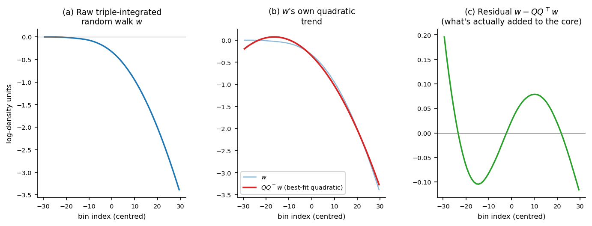
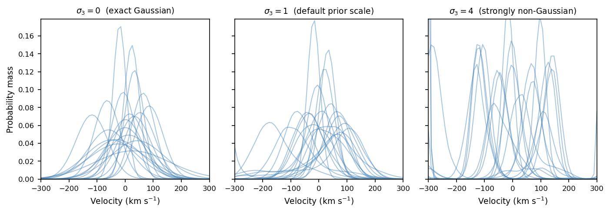

# Methodology

## Overview

`veldist` recovers the intrinsic line-of-sight velocity distribution (LOSVD)
from a discrete set of stellar velocities, each measured with its own
uncertainty.  The approach is non-parametric: rather than assuming the LOSVD
follows a Gaussian or Gauss-Hermite expansion, we solve for the probability
mass in each bin of a fixed velocity histogram.  Regularisation is provided
by a smoothness prior whose scale is treated as a free hyperparameter and
marginalised over during inference.  Measurement errors enter the likelihood
exactly, with no assumptions about their distribution across stars.

`KinematicSolver.run()` supports two smoothness priors, selected with
`prior="gaussian_core"` (the default) or `prior="rw1"`. They differ in what
shape the prior settles on when the data are uninformative (see
"Smoothing prior" below), but share everything else described in this page:
the histogram representation, the design-matrix likelihood, and the NUTS
sampler.

The method is closest in spirit to the penalised-likelihood approach of
Merritt (1997) and Saha & Williams (1994), but replaces the manual smoothing
penalty with a marginalised Bayesian prior and uses MCMC sampling rather than
optimisation.

---

## The Model

The model has two jobs: represent an LOSVD of unknown shape without assuming
a functional form for it, and stop that freedom from overfitting noise in a
handful of stars. The first is handled by a histogram of bin weights, free
to take any shape the data support. The second is handled by a smoothing
prior, which states what the LOSVD should look like where the data are
silent, so that low-count bins and the wings of the distribution do not
default to spraying probability mass around arbitrarily.

### Histogram representation

We represent the intrinsic LOSVD as a vector of probability masses
$\mathbf{w} \in \mathbb{R}^K$ on a fixed velocity grid with $K$ bins,
where $\sum_j w_j = 1$.  The grid is defined by a central velocity, total
width, and number of bins.  The bin width $\Delta v$ is chosen to be
comparable to the typical measurement uncertainty, so that the data can
resolve individual bins.

### Smoothing prior

A flat histogram is not a useful prior for stellar kinematics: real LOSVDs
are smooth. What "smooth" should mean when the data can't pin down a
feature is where the two priors below disagree, and it matters: whichever
shape the prior settles on when the likelihood is weak is exactly the shape
that dominates in low-$N$ bins and in the wings of every bin.

#### `gaussian_core` (default)

`generate_gaussian_core_curve` (`src/veldist/veldist.py`) splits the latent
log-density curve into a free Gaussian core plus a penalised deviation:

$$
u(v) = \underbrace{-\tfrac{1}{2}\left(\frac{v - v_0}{s_0}\right)^2}_{\text{core, unpenalised}}
   \;+\; \underbrace{\left[w(v) - Q Q^\top w(v)\right]}_{\text{deviation, penalised}},
\qquad w = \mathrm{cumsum}^3(\sigma_3\, d_3)
$$

$v_0$ and $s_0$ (a location and a width) are free, inferred with no
smoothness penalty at all.

**Building $w$.** $d_3$ is a vector of independent standard-normal draws,
one per bin: white noise. Cumulatively summing it once turns white noise
into a random walk. Summing that random walk again integrates it into a
smoother, more slowly varying curve, and a third cumulative sum
($\mathrm{cumsum}^3$) integrates it once more. Three integrations of noise
produce a curve that looks locally like a wandering cubic (panel (a)
below).

**Why that curve has to be detrended.** A curve built this way is not
"pure wiggle." Integrating noise three times also generates broad,
low-frequency swings that look like an up-to-quadratic trend, a curve of
the form $a + bv + cv^2$, riding on top of the fine structure: panel (b)
below shows one draw's own best-fit quadratic sitting almost on top of it.
That is a problem, because the Gaussian core $-\tfrac12((v-v_0)/s_0)^2$
is *also* a quadratic in $v$. If $w$ were added to the core as drawn, its
quadratic component and the core's $v_0$/$s_0$ would both be trying to
explain the same broad shape, two parameters describing one feature.
Neither would be identifiable from the data alone, and NUTS would diverge
hunting for a posterior mode that does not exist.

The deviation term needs one restriction, and it is worth stating plainly
before the algebra. The deviation is a random wiggly curve added to the core.
A Gaussian's log-density *is* a parabola. So if the wiggles happen to come out
parabolic, they are indistinguishable from the core itself: the core width and
the deviation are then two names for one degree of freedom, the posterior
develops a funnel, and NUTS diverges. The fix is to forbid the deviation from
containing any parabola at all. In one line: **strip the parabola out of the
wiggles, so that only the core is allowed to be parabolic.**

Mechanically, `Q` is an orthonormal basis for the space of constant, linear,
and quadratic functions of velocity. For any curve `w`, the product `QQ'w` is
`w`'s own least-squares parabola. Subtracting it leaves a curve guaranteed to
have no constant, linear, or quadratic component, which is exactly the
restriction above. Everything below is the derivation of that statement.

#### Why this is a projection

**The fix: subtract $w$'s own quadratic trend.** Start with the three
functions $1$, $v$, $v^2$, evaluated at the bin centres: three vectors in
$\mathbb{R}^{N_\mathrm{bins}}$ that span every possible quadratic curve on
the grid. Gram-Schmidt (computed here via QR decomposition) turns them
into three vectors $q_1, q_2, q_3$ that span the same space but are
mutually perpendicular and unit length; stack them as the columns of $Q$.
This basis is built once per grid and cached, since it depends only on the
bin centres, never on a sampled value.

That orthonormality is what makes the projection simple. To find how much
of $w$ points along a single direction $q_i$, take the dot product $q_i
\cdot w$: the standard way to read off a component along a unit vector,
the same operation used to decompose a force into $x$- and
$y$-components in introductory mechanics. Doing that for all three
directions at once is exactly what the matrix-vector product $Q^\top w$
computes: a length-3 vector of coordinates, $w$'s address in the quadratic
subspace. A curve is rebuilt from those coordinates by weighting each
$q_i$ by its coordinate and summing, $c_1 q_1 + c_2 q_2 + c_3 q_3$, which
is exactly what $Qc$ computes. Chaining the two steps, $QQ^\top w =
Q(Q^\top w)$, means: read off $w$'s quadratic coordinates, then rebuild a
curve using only those coordinates, i.e. $w$ with everything except its
quadratic part discarded. Because the $q_i$ are orthonormal, that
reconstruction is also provably the *closest* quadratic curve to $w$ in
the least-squares sense: the same curve `numpy.polyfit(..., deg=2)` would
return. $QQ^\top$ therefore fits and projects in a single matrix multiply.

So $QQ^\top w(v)$ is $w$'s own best-fit quadratic, and

$$
\text{deviation} = w - QQ^\top w
$$

is what remains once that quadratic part is subtracted off (panel (c)
below). This is the same move as detrending a light curve or a spectrum:
fit and subtract a low-order polynomial, then keep the residual. Whatever
survives that subtraction has, by construction, zero component along $1$,
$v$, and $v^2$, so it genuinely cannot be produced by adjusting
$v_0$/$s_0$. The two terms stay identifiable, and the deviation is free to
add real, higher-order structure on top of the Gaussian core.

*One draw of $w$ (a), its own least-squares quadratic fit $QQ^\top w$ (b,
red, exactly what $v_0$/$s_0$ could otherwise be pulled into mimicking),
and the residual $w - QQ^\top w$ (c): what actually gets added to the
core once the quadratic component is removed.*

The deviation term is standardised (Sørbye & Rue 2014) so that $\sigma_3$
is directly interpretable as a typical log-density departure from a
Gaussian, independent of how finely the grid is binned. $\sigma_3$ has an
$\mathrm{Exponential}$ prior centred on $\sigma_3 = 0$: a
penalised-complexity prior (Simpson et al. 2017) that shrinks toward the
base model (an exact Gaussian LOSVD) while leaving strongly non-Gaussian
shapes reachable when the likelihood demands them.

This is the discrete, generative analogue of the roughness penalty
$\int \left[\mathrm{d}^3/\mathrm{d}v^3 \log N(v)\right]^2\,\mathrm{d}v$ used
by Merritt (1997, AJ, 114, 228): a Gaussian's log-density is exactly
quadratic, so its third derivative, and the penalty, vanish identically.
**The infinite-smoothing limit is therefore a Gaussian with the data's own
mean and dispersion**, not a flat histogram. That matters in the wings of
every bin and in any low-$N$ bin: where the likelihood is uninformative,
`gaussian_core` relaxes toward a physically motivated LOSVD shape rather
than toward spreading mass out to the grid edges.

*Prior realisations at $\sigma_3 = 0$ (exact Gaussian, left), $\sigma_3 = 1$
(the default `Exponential` prior's scale, centre), and $\sigma_3 = 4$
(strongly non-Gaussian, right). As $\sigma_3 \to 0$ every draw collapses to
a Gaussian; as $\sigma_3$ grows the deviation term adds structure on top of
that core.*

#### `rw1` (legacy, `prior="rw1"`)

The original prior, kept for comparison. It imposes smoothness via an
intrinsic first-order random-walk (RW1) Gaussian Markov Random Field on a
latent curve $\mathbf{u} \in \mathbb{R}^K$, penalising the differences
between adjacent bins:

$$
\log p(\mathbf{u} \mid \sigma_\mathrm{smooth}) = -\frac{1}{2\sigma_\mathrm{step}^2}
\sum_{i=1}^{K-1} (u_i - u_{i-1})^2 - (K-1)\log\sigma_\mathrm{step} + \mathrm{const.}
$$

rescaled by $\sqrt{\Delta v}$ ($\sigma_\mathrm{step} = \sigma_\mathrm{smooth}\sqrt{\Delta v}$)
so its meaning is independent of grid resolution. This form treats every bin
identically (no fixed endpoint, so no bin is regularised more tightly than
another), but its **infinite-smoothing limit is a uniform LOSVD over the
whole grid**, not a Gaussian. Because kurtosis weights deviations by the
fourth power, even a small amount of prior-driven mass pushed out toward the
grid edges produces a measurable positive kurtosis bias and a
velocity-dispersion bias that grows with the number of bins. This is why
`gaussian_core` is the default; see `docs/validation.md` for the measured
comparison.

*Prior realisations at $\sigma_\mathrm{smooth} = 0.02$ (left), $0.1$ (centre), and $0.5$ (right).  Lighter values of $\sigma_\mathrm{smooth}$ enforce smoother LOSVDs; larger values allow the prior to explore more structured shapes. Note the flat, uniform-over-the-grid character these settle toward: the behaviour `gaussian_core` was introduced to replace.*

Both priors share the same free hyperparameter mechanism: the smoothness
scale ($\sigma_3$ or $\sigma_\mathrm{smooth}$) is not fixed by the user, but
sampled and marginalised jointly with the LOSVD itself, so the effective
smoothness adapts automatically to the signal-to-noise of each bin.

---

## The Likelihood: Design Matrix

### The deconvolution problem

The central difficulty is that every star has a different measurement
uncertainty $\varepsilon_i$.  The observed velocity $y_i$ of star $i$ is
drawn from a distribution that is the convolution of the intrinsic LOSVD
with the star's measurement error kernel:

$$
p(y_i \mid \mathbf{w}) = \sum_{j=1}^{K} w_j \,
  \mathcal{N}\!\left(y_i \,\big|\, c_j,\, \varepsilon_i^2\right)
$$

where $c_j$ is the centre of bin $j$.  Evaluating this naïvely for all $N$
stars at every MCMC step is an $O(N K)$ operation that involves $N K$
exponential evaluations, which is expensive for large samples.

### Pre-computing the design matrix

We avoid this by pre-computing the $N \times K$ **design matrix** $\mathbf{M}$
before inference begins.  Entry $M_{ij}$ is the probability that star $i$
would be observed in its measured position, given that it originates from
intrinsic bin $j$.  Since $y_i \sim \mathcal{N}(c_j, \varepsilon_i^2)$, this
is the integral of the Gaussian error kernel over the bin extent
$[c_j - \Delta v/2,\, c_j + \Delta v/2]$:

$$
M_{ij} = \Phi\!\left(\frac{c_j + \Delta v/2 - y_i}{\varepsilon_i}\right)
        - \Phi\!\left(\frac{c_j - \Delta v/2 - y_i}{\varepsilon_i}\right)
$$

where $\Phi$ is the standard normal CDF.  This is computed once from the
observed velocities and errors, and held fixed throughout inference.

Each row of $\mathbf{M}$ corresponds to one star and has the shape of a
Gaussian centred at $y_i$ with width $\varepsilon_i$, sampled at the grid
bins.  Stars with large errors have broad, flat rows; stars with small errors
have narrow, peaked rows concentrated in one or two bins.

*Left: the full $\mathbf{M}$ matrix for a small example dataset, with stars
ordered by measurement error.  Right: three individual rows, showing how
the per-star error kernel is integrated over the velocity bins.  Stars with
large $\varepsilon_i$ (top row) contribute broad constraints; stars with small
$\varepsilon_i$ (bottom row) constrain a narrow range of bins.*

### Likelihood evaluation

Once $\mathbf{M}$ is available, the likelihood of the observed data given the
weight vector $\mathbf{w}$ is:

$$
\ln \mathcal{L}(\mathbf{w}) = \sum_{i=1}^{N} \ln \left( [\mathbf{M}\mathbf{w}]_i \right)
$$

The product $\mathbf{M}\mathbf{w}$ is a single matrix–vector multiplication:
an $O(NK)$ operation with no exponential evaluations inside the MCMC loop.
This is the key computational advantage of the design-matrix approach: the
expensive integrals are computed once at setup time, and inference itself
requires only linear algebra.

---

## Inference

Posterior sampling is performed with the No-U-Turn Sampler (NUTS; Hoffman &
Gelman 2014) as implemented in NumPyro (Phan et al. 2019).  NUTS is a
gradient-based Hamiltonian Monte Carlo variant that adapts its step size and
trajectory length automatically, making it well suited to the high-dimensional
posteriors that arise for fine velocity grids.

The sampler simultaneously infers the latent curve (`gaussian_core`'s
$v_0$, $s_0$, $\sigma_3$, $d_3$, or `rw1`'s $\mathbf{u}$ and
$\sigma_\mathrm{smooth}$, depending on `prior`) and derives $\mathbf{w}$
from it via `softmax`. The posterior over $\mathbf{w}$ therefore
marginalises over the smoothing scale, propagating its uncertainty into
all derived quantities. Users can run on GPU by passing `gpu=True` to
`KinematicSolver.run()`, which can reduce wall time by an order of
magnitude for large batches.

The default chain settings (500 warmup, 3000 samples, 4 chains, dense mass
matrix, `target_accept_prob=0.95`) are sufficient for typical
globular-cluster or dwarf galaxy bins with $\gtrsim 30$ stars; see
`KinematicSolver.run`'s docstring for the measurements behind each of
those defaults. For bins with $N_\star \lesssim 20$ or for grids finer
than $\Delta v \sim \varepsilon_\mathrm{typ}$, the posterior will be
prior-dominated; this is expected behaviour and the uncertainty intervals
will reflect it.

---

## Relationship to Prior Work

### Merritt (1997); Saha & Williams (1994)

Both papers introduced the design-matrix formulation for LOSVD recovery from
discrete stellar velocities, with regularisation through a roughness penalty
applied to $\mathbf{w}$ (penalised likelihood).  The penalty scale $\lambda$
was chosen by the user or estimated from the data.  `veldist` replaces the
fixed penalty with a Gaussian random walk prior whose scale is marginalised
during sampling; this avoids manual tuning and provides formal uncertainty
estimates on the smoothing scale itself.

### Falcón-Barroso & Martig (2021): BayesLOSVD

BayesLOSVD introduced a Bayesian, non-parametric LOSVD extraction framework
for IFU spectra, using MCMC regularisation and a similar random walk prior.
The key difference is the data model: BayesLOSVD operates on integrated-light
spectra and requires a template stellar library and a deconvolution step with
the instrumental line-spread function.  `veldist` targets discrete stellar
velocities, where the data are individual measurements with per-star error
bars, and no template is needed.  The design-matrix likelihood is specific to
this regime and cannot be used for spectral fitting.

`veldist` uses the BayesLOSVD ECSV file format for Dynamite input, which
allows the two codes to be used in sequence: `veldist` extracts LOSVDs from
resolved stellar data, which are then passed to Dynamite's `histLOSVD`
kinematics handler.

### Bovy, Hogg & Roweis (2011): Extreme Deconvolution

Extreme Deconvolution (XD) also handles heteroscedastic per-object errors,
but models the intrinsic distribution as a mixture of Gaussians rather than
a non-parametric histogram.  The mixture representation is efficient when the
distribution is approximately Gaussian or a small sum of Gaussians, but
cannot represent flat-topped, asymmetric, or multimodal LOSVDs without a
large number of components.  `veldist` makes no shape assumption; the prior
favours smooth solutions over rough ones.
