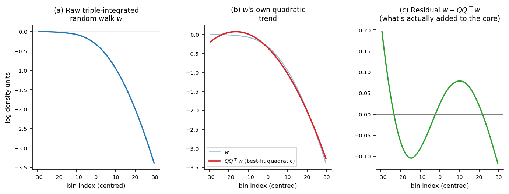
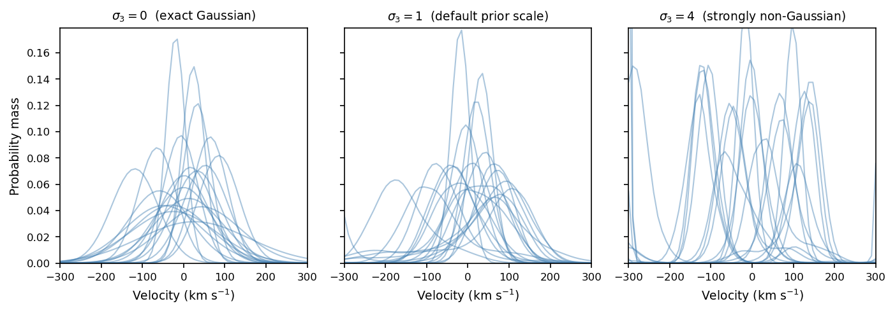
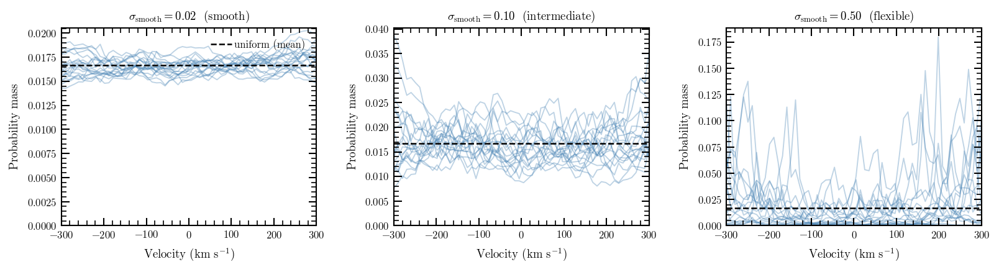
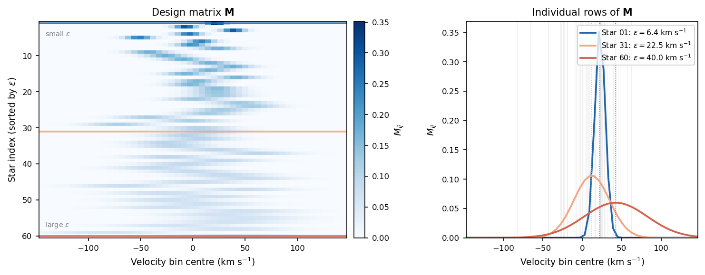

# Methodology

## Overview

`veldist` recovers the intrinsic line-of-sight velocity distribution (LOSVD)
from a set of stellar velocities, each with its own measurement uncertainty.
The method is non-parametric. Instead of assuming a Gaussian or a
Gauss-Hermite expansion, it solves for the probability mass in each bin of a
fixed velocity histogram. A smoothness prior regularises the solution, and
the strength of that prior is a free hyperparameter that is marginalised over
during sampling. Measurement errors enter the likelihood exactly, star by
star.

`KinematicSolver.run()` offers two smoothness priors: `prior="gaussian_core"`
(the default) and `prior="rw1"`. They differ only in the shape they fall back
to when the data are uninformative. The histogram representation, the
likelihood and the sampler are shared.

The closest earlier work is the penalised-likelihood method of Merritt (1997)
and Saha & Williams (1994). `veldist` replaces their hand-tuned smoothing
penalty with a prior whose scale is inferred, and samples the posterior with
MCMC instead of optimising.

---

## The Model

A histogram of bin weights can take any shape, which is what we want for an
LOSVD of unknown form. With only a few stars per bin, though, that freedom
will happily fit noise. The smoothing prior supplies the missing information:
it says what the LOSVD should look like where the data have nothing to say,
which in practice means the wings and any sparsely populated bin.

### Histogram representation

The LOSVD is a vector of probability masses $\mathbf{w} \in \mathbb{R}^K$ on
a fixed grid of $K$ bins, with $\sum_j w_j = 1$. The grid is set by a central
velocity, a total width and the number of bins. Choose the bin width
$\Delta v$ to be comparable to the typical measurement error, so that the
data can resolve individual bins.

#### Mass, not density

$w_j$ is the integral of the LOSVD over bin $j$, not the density at the bin
centre. The two differ at second order:

$$\int_{\text{bin}} f(v)\,\mathrm{d}v \;=\; h\,f(v_j) \;+\; \frac{h^3}{24}f''(v_j) \;+\; O(h^5).$$

Because $f''$ is positive in the tails and negative near the peak, sampling
the density at bin centres under-weights the tails and makes the
distribution too narrow.

Three parts of the code use $w_j$, and all three have to treat it as mass:

1. The **likelihood** integrates each star's error kernel over the bin (see
   *Pre-computing the design matrix*). This amounts to a piecewise-constant
   density $p(v) \approx w_j/h$ inside each bin, whose variance is
   $\sum_j w_j (v_j-\mu)^2 + h^2/12$.
2. The **Gaussian core of the prior** must be a Gaussian's bin mass. Writing
   it as $\mathrm{softmax}(-\tfrac12 Q)$ would give the density at bin
   centres instead, and the core would come out narrower than the Gaussian
   it is meant to be. The code integrates it over each bin.
3. The **reported moments** add the same $h^2/12$ back, so the reported
   dispersion estimates the continuous LOSVD rather than a sum of point
   masses at the bin centres.

A mistake in any of these gives a bias that scales as $h^2$, touches only
the second and higher moments, and passes every normalisation check. It
looks like a resolution problem that more bins would fix. Both the prior and
the moment errors existed in earlier versions of this code and were found
only by sweeping the grid resolution.

### Smoothing prior

A flat prior on the histogram is a poor choice for stellar kinematics, since
real LOSVDs are smooth. The two priors below disagree about what "smooth"
means when the data cannot decide, and this matters: the shape the prior
prefers is the shape you get in low-$N$ bins and in the wings of every bin.

#### `gaussian_core` (default)

`generate_gaussian_core_curve` in `src/veldist/veldist.py` writes the log of
the LOSVD as a Gaussian core plus a penalised deviation:

$$
u(v) = \underbrace{-\tfrac{1}{2}\left(\frac{v - v_0}{s_0}\right)^2}_{\text{core, unpenalised}}
   \;+\; \underbrace{\left[w(v) - Q Q^\top w(v)\right]}_{\text{deviation, penalised}},
\qquad w = \mathrm{cumsum}^3(\sigma_3\, d_3)
$$

The core's location $v_0$ and width $s_0$ are inferred with no smoothness
penalty.

**Building the deviation.** $d_3$ is white noise: one standard-normal draw
per bin. One cumulative sum turns it into a random walk, and two more make
it progressively smoother. After three sums, $w$ looks locally like a
wandering cubic (panel (a) below).

**Removing its quadratic part.** A curve built this way also carries broad,
low-order swings. Panel (b) shows a draw with its own best-fit quadratic
lying almost on top of it. That is a problem, because the log of a Gaussian
is itself a quadratic in $v$. If $w$ were added to the core unchanged, the
core parameters and the quadratic part of $w$ would describe the same
feature. The data could not separate them, the posterior would develop a
funnel, and NUTS would diverge.

The fix is to remove every constant, linear and quadratic component from
$w$, so that only the core can be parabolic. $Q$ is an orthonormal basis for
the quadratics on the grid: the vectors $1$, $v$ and $v^2$ evaluated at the
bin centres, orthonormalised with a QR decomposition. It depends only on the
bin centres, so it is built once per grid and cached.

With an orthonormal basis, projection is one matrix product. $Q^\top w$
gives the three coordinates of $w$ along the basis vectors, and multiplying
by $Q$ rebuilds the curve from those coordinates alone. So $QQ^\top w$ is
the least-squares quadratic fit to $w$, the same curve
`numpy.polyfit(..., deg=2)` would return, and

$$
\text{deviation} = w - QQ^\top w
$$

is the residual after subtracting it (panel (c)). This is the same operation
as detrending a light curve with a low-order polynomial. The residual has no
component along $1$, $v$ or $v^2$, so nothing in it can be absorbed by
$v_0$ or $s_0$. It can only add higher-order structure on top of the core.

*One draw of $w$ (a), its least-squares quadratic fit $QQ^\top w$ (b, red),
which is the part $v_0$ and $s_0$ would otherwise compete with, and the
residual $w - QQ^\top w$ (c) that is added to the core.*

The deviation is standardised (Sørbye & Rue 2014) so that $\sigma_3$ reads
as a typical log-density departure from a Gaussian, independent of the bin
width. $\sigma_3$ has an exponential prior with its mode at zero. This is a
penalised-complexity prior (Simpson et al. 2017): it shrinks toward the base
model, an exact Gaussian LOSVD, but still allows strongly non-Gaussian shapes
when the likelihood asks for them.

The construction is a discrete, generative version of Merritt's (1997, AJ,
114, 228) roughness penalty
$\int \left[\mathrm{d}^3/\mathrm{d}v^3 \log N(v)\right]^2\,\mathrm{d}v$.
A Gaussian's log-density is exactly quadratic, so its third derivative and
the penalty both vanish. (On the grid, the core is a Gaussian's bin mass,
whose logarithm differs from a parabola at $O(h^4)$. That is far below the
scale of the deviation and does not affect the argument above.)

The consequence is that **with infinite smoothing, the prior gives a
Gaussian with the data's own mean and dispersion**, not a flat histogram.
Where the likelihood is weak, `gaussian_core` falls back to a physically
reasonable shape instead of spreading mass toward the grid edges.

*Prior draws at $\sigma_3 = 0$ (an exact Gaussian, left), $\sigma_3 = 1$
(the scale of the default exponential prior, centre) and $\sigma_3 = 4$
(strongly non-Gaussian, right).*

#### `rw1` (legacy, `prior="rw1"`)

The original prior, kept for comparison. It is an intrinsic first-order
random walk (RW1) on a latent curve $\mathbf{u} \in \mathbb{R}^K$, which
penalises differences between neighbouring bins:

$$
\log p(\mathbf{u} \mid \sigma_\mathrm{smooth}) = -\frac{1}{2\sigma_\mathrm{step}^2}
\sum_{i=1}^{K-1} (u_i - u_{i-1})^2 - (K-1)\log\sigma_\mathrm{step} + \mathrm{const.}
$$

The step scale is $\sigma_\mathrm{step} = \sigma_\mathrm{smooth}\sqrt{\Delta v}$,
so $\sigma_\mathrm{smooth}$ means the same thing at any grid resolution. The
walk has no fixed endpoint and treats every bin alike. Its problem is the
infinite-smoothing limit, which is a **uniform LOSVD across the whole grid**.
Kurtosis weights deviations by the fourth power, so even a little
prior-driven mass near the grid edges produces a clear positive kurtosis
bias, along with a dispersion bias that grows with the number of bins. This
is why `gaussian_core` is now the default; [Validation](validation) has the
measured comparison.

*Prior draws at $\sigma_\mathrm{smooth} = 0.02$ (left), $0.1$ (centre) and
$0.5$ (right). Small values give smooth LOSVDs and larger values allow more
structure. Note how they flatten toward a uniform distribution over the
grid.*

In both priors the smoothness scale ($\sigma_3$ or $\sigma_\mathrm{smooth}$)
is sampled along with the LOSVD rather than fixed by the user, so the
effective smoothing adapts to the signal-to-noise of each bin.

---

## The Likelihood: Design Matrix

This is what makes the method fast. How a star's measurement error spreads
across the velocity grid depends only on that star's velocity and error, not
on the current LOSVD, so it never changes during sampling. `veldist`
computes it once for every star and every bin, stores it as a matrix
$\mathbf{M}$, and each NUTS step then needs only a matrix-vector product.
The likelihood is still exact; nothing is approximated.

### The deconvolution problem

Each star has its own measurement error $\varepsilon_i$. Its observed
velocity $y_i$ is drawn from the intrinsic LOSVD convolved with that
star's error kernel:

$$
p(y_i \mid \mathbf{w}) = \sum_{j=1}^{K} w_j \,
  \mathcal{N}\!\left(y_i \,\big|\, c_j,\, \varepsilon_i^2\right)
$$

where $c_j$ is the centre of bin $j$. Evaluating this directly costs $N K$
exponentials per MCMC step, which adds up for large samples.

### Pre-computing the design matrix

Instead, the $N \times K$ **design matrix** $\mathbf{M}$ is built before
sampling starts. $M_{ij}$ is the probability of observing star $i$ at $y_i$
given that its true velocity lies in bin $j$. Integrating the Gaussian error
kernel over the bin $[c_j - \Delta v/2,\, c_j + \Delta v/2]$ gives

$$
M_{ij} = \Phi\!\left(\frac{c_j + \Delta v/2 - y_i}{\varepsilon_i}\right)
        - \Phi\!\left(\frac{c_j - \Delta v/2 - y_i}{\varepsilon_i}\right)
$$

where $\Phi$ is the standard normal CDF.

Each row is a Gaussian centred on $y_i$ with width $\varepsilon_i$,
integrated over the bins. A star with a large error has a broad, flat row;
a star with a small error concentrates its row in one or two bins.

*Left: $\mathbf{M}$ for a small example dataset, with stars sorted by
measurement error. Right: three individual rows. Stars with large
$\varepsilon_i$ (top) give broad constraints; stars with small
$\varepsilon_i$ (bottom) pin down a narrow range of bins.*

### Likelihood evaluation

With $\mathbf{M}$ in hand, the log-likelihood is

$$
\ln \mathcal{L}(\mathbf{w}) = \sum_{i=1}^{N} \ln \left( [\mathbf{M}\mathbf{w}]_i \right)
$$

$\mathbf{M}\mathbf{w}$ is a single matrix-vector product: still $O(NK)$,
but with no exponentials inside the sampling loop.

---

## Inference

The posterior has one dimension per velocity bin plus a few
hyperparameters, typically several tens in all. Grid and rejection sampling
are hopeless at that size. The model is differentiable, though, so
gradient-based Hamiltonian Monte Carlo is a natural fit.

`veldist` uses the No-U-Turn Sampler (NUTS; Hoffman & Gelman 2014) in
NumPyro (Phan et al. 2019), which tunes its step size and trajectory length
automatically.

The sampler infers the latent curve (for `gaussian_core`: $v_0$, $s_0$,
$\sigma_3$ and $d_3$; for `rw1`: $\mathbf{u}$ and $\sigma_\mathrm{smooth}$)
and maps it to $\mathbf{w}$ with a softmax. The posterior on $\mathbf{w}$
therefore already accounts for uncertainty in the smoothing scale. Passing
`gpu=True` to `KinematicSolver.run()` runs on a GPU, which can cut wall time
by an order of magnitude for large batches.

The defaults (500 warmup steps, 3000 samples, 4 chains, dense mass matrix,
`target_accept_prob=0.95`) work for typical globular-cluster or dwarf-galaxy
bins with $\gtrsim 30$ stars. The `KinematicSolver.run` docstring explains
how each was chosen. With $N_\star \lesssim 20$, or a grid finer than
$\Delta v \sim \varepsilon_\mathrm{typ}$, the posterior is dominated by the
prior. That is expected, and the credible intervals widen to reflect it.

---

## Relationship to Prior Work

### Merritt (1997); Saha & Williams (1994)

These papers introduced the design-matrix formulation for recovering an
LOSVD from discrete velocities, regularised with a roughness penalty on
$\mathbf{w}$. The penalty strength $\lambda$ was set by the user or
estimated from the data. `veldist` replaces the fixed penalty with a prior
whose scale is marginalised during sampling. There is nothing to tune, and
the uncertainty in the smoothing scale is carried into the result.

### Falcón-Barroso & Martig (2021): BayesLOSVD

BayesLOSVD is a Bayesian, non-parametric LOSVD method for IFU spectra, with
a similar random-walk prior. It works on integrated-light spectra, so it
needs a stellar template library and has to deconvolve the instrumental
line-spread function. `veldist` works on discrete velocities with per-star
errors and needs no templates. Its design-matrix likelihood does not apply to
spectral fitting.

`veldist` writes the BayesLOSVD ECSV format, so its output can go straight
into Dynamite's `histLOSVD` kinematics handler.

### Bovy, Hogg & Roweis (2011): Extreme Deconvolution

Extreme Deconvolution (XD) also handles per-object errors, but models the
intrinsic distribution as a mixture of Gaussians. That is efficient when the
distribution is close to Gaussian or a sum of a few Gaussians, but a
flat-topped, skewed or multimodal LOSVD needs many components. `veldist`
assumes no shape; its prior only prefers smooth solutions to rough ones.
