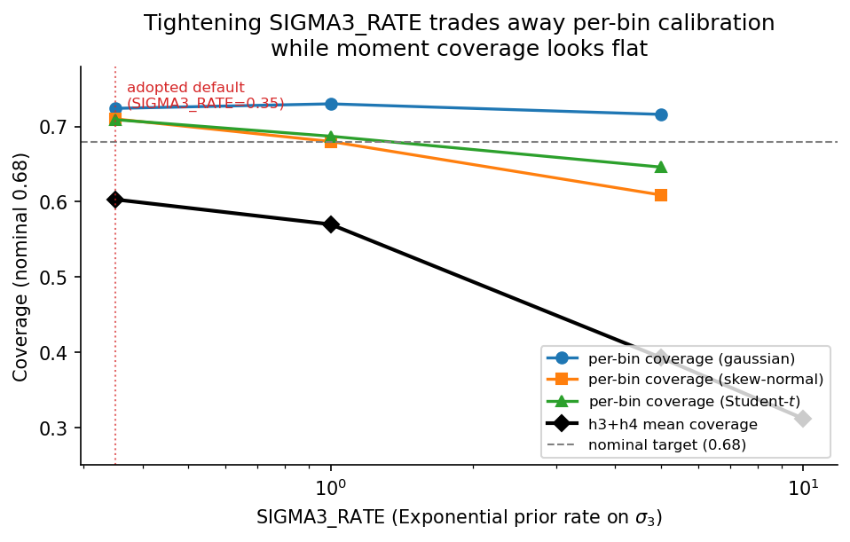

# Validation

This page summarises the statistical validation in the test suite for the 1D
(`KinematicSolver`) and 2D (`KinematicSolver2D`) solvers, and the 2D solver's
performance gate. It reports what these tests found, including a known
unresolved bias. See `PLAN.md` §1.2, §1.3, §3.3, and §3.4 for the full
methodology.

## What SBC validates

Simulation-Based Calibration (SBC; Talts et al. 2018) checks the sampler
against the model itself: draw a parameter from the model's own prior,
simulate synthetic data from it, run inference, and check that the true
parameter's rank among the posterior draws is uniformly distributed. This
is a test of implementation correctness. A wrong random-walk prior, an
off-by-half-bin design matrix, or a `numpyro.factor` term invisible to
`Predictive` all show up as non-uniform rank histograms. It does **not**
check whether the model describes real data well.

## What coverage validates

Frequentist coverage testing validates the *model against reality*, not
against itself. For a handful of fixed, physically motivated truths (not
drawn from the model's prior), we generate many independent mock datasets,
fit each, and check whether the true value falls inside the reported 68%
credible interval the stated fraction of the time. This test matters for a
downstream consumer such as Dynamite's NNLS $\chi^2$, which takes the
reported uncertainties literally. Coverage can fail even when SBC passes
cleanly, because SBC's "truth" is always self-consistent with the model's
prior. A smoothness prior that shrinks away genuine sharp features in real
data is invisible to SBC but shows up directly in coverage.

## Reading the metrics

Each metric answers a different question and has a specific blind spot. The
short version of how to read them:

| Metric | Asks | Target | Blind spot |
|---|---|---|---|
| SBC failure fraction | What share of simulations could not be evaluated (NaN, crash, too few independent draws)? | ≤ 2% | It is a count: at n=30 a difference of one is noise. Only large gaps (17% vs 2%) are real. |
| SBC rank uniformity (KS p) | Does the truth fall at a uniform quantile of the posterior? | p > 0.05 | Computed only over simulations that *completed*. If the hard cases are the ones failing, this is calibration on the easy subset. |
| ESS | How many independent draws, out of the nominal count? | ≫ 20 | Says nothing about correctness: a chain can mix well around a wrong answer. |
| Moment coverage | Does the credible interval contain the true moment? | 0.68 | Gameable: a useless estimator with huge error bars scores perfectly. Read with efficiency. |
| **Per-bin LOSVD coverage** | Does `losvd_median ± losvd_uncertainty` contain the true mass, bin by bin? | 0.68 | Empty bins over-cover trivially (~0.88) because the uncertainty floor dominates; they must be excluded. |
| Efficiency | Estimator scatter ÷ statistical optimum (`σ/√N` for the mean, `σ/√(2N)` for the dispersion). | 1.0 | With few realisations a single bad fit dominates. Use a robust (16–84 percentile) scatter. |
| Bias | Systematic offset in the recovered value. | ≈ 0 | Only meaningful against a scale: compare to the optimal precision, not to zero. |

### Three traps worth knowing

**Efficiency below 1.0 is not a win.** Nothing beats the statistical optimum,
so a value under 1.0 means the prior is shrinking estimates toward a common
answer. It must be read alongside the bias, never on its own.

**Moment coverage does not imply per-bin coverage.** Moments compress ~37 bins
into 5 scalars, and over-wide intervals in one bin cancel over-tight ones in
another. Measured: tightening `SIGMA3_RATE` from 1.0 to 5.0 left every moment
metric flat while per-bin coverage fell 0.680 → 0.609 on `skew_normal_h3`.
Per-bin is the artifact DYNAMITE $\chi^2$-weights, so when the two disagree,
per-bin is the one that matters.

**A shrinkage prior scores well on moments whose true value is zero.** Both
`flat_top_tangential` and `student_t_h4` are symmetric, so their true skewness
is ~0; a tight prior shrinks skewness toward 0 and scores near-perfect coverage
for entirely the wrong reason. Read each coverage cell against whether that
truth has signal in that moment. The same caution applies to any test case
sitting where the prior already points: a Gaussian truth cannot measure what a
Gaussian-core prior costs.

### How they combine

SBC is a **gate, not an objective**: pass/fail, with near-boundary results
treated as ties. Among configurations that pass, choose on what is recovered,
taking per-bin coverage first and then the moments that carry real signal.

## 1D solver results

**SBC** (`tests/test_calibration.py`, `n_bins=15`, `n_stars=200`,
500 warmup + 1200 samples, `n_sims=30`): passes for **both** the RW1 and
Gaussian-core priors, with 0/30 failed simulations.

This gate depends on the sampler configuration, not only on the model. At
NumPyro's default `target_accept_prob=0.8` the Gaussian-core prior fails it,
with 17% of simulations discarded for inadequate effective sample size on
`sigma3`. The cause is funnel geometry: as the deviation scale approaches zero
the posterior narrows into a neck that a step size adapted on the funnel's
mouth cannot traverse, so chains stick. Raising the acceptance target to 0.95
fixes it (1/100 failures at `n_sims=100`); extra warmup does not substitute,
since 1500 warmup steps at 0.8 still failed. See "Sampler configuration" below. The SBC harness
is now parametrised over ``SBC_PRIORS = ["rw1", "gaussian_core"]``
(see `tests/test_calibration.py`). This SBC run caught an earlier bug: the
original random-walk prior used `numpyro.factor` on an unconditioned base
measure. Because `numpyro.factor` is invisible to `Predictive`, the SBC
"truth" was silently drawn from the wrong distribution. The prior was
rewritten generatively; SBC then passed cleanly.

**Prior-predictive null-space test** (`tests/test_prior_predictive.py`):
the Gaussian-core prior's prior-predictive median velocity dispersion is
~32 km/s on a 400 km/s wide grid (vs. ~115 for uniform), confirming the
null space is quadratic, not flat. This is resolution-invariant to within
3% relative spread across n_bins = 20/40/80.

**Bias tests** (`tests/test_moment_bias.py`): for a Gaussian truth
(σ = 40 km/s, N = 150 stars, n_bins ∈ {20, 80}), the Gaussian-core prior
shows |kurtosis bias| < 0.35 and |σ bias| < 3%, and the σ bias does not grow
with bin count. The RW1 negative control still reproduces the known
+1.1 kurtosis and +4% σ bias at n_bins = 80. Note that the pre-fix version of
this result was uninformative for the non-Gaussian deviation: with the
deviation term inert (marginal SD ~0.0036), a posterior collapsed onto a
Gaussian trivially satisfied the Gaussian-truth bias thresholds.

**Coverage** (`tests/test_coverage.py`, `n_real=25` per truth, `n_stars=150`,
`n_bins=20`, four truths: Gaussian, Student-$t$ ($\nu=6$), skew-normal,
counter-rotating bimodal): parametrised over both priors. For the
**Gaussian-core prior** (without truncation) this test currently **fails**, and
also failed before the RW3 scaling fix. It is a standing known-red result
rather than a regression, and is marked `xfail(strict=False)` so that an
improvement shows up as an XPASS.

The Gaussian truth shows over-coverage in kurtosis (1.000, all 25/25 intervals
contain the truth) and skewness (0.960); the error bars are conservative but
valid. This row is not evidence about the deviation term either way: kurtosis
coverage was also 1.000 *before* the fix, because a posterior collapsed onto a
Gaussian covers a Gaussian truth perfectly.

The non-Gaussian truths still show under-coverage in kurtosis and tail_weight.
Measured pre-fix → post-fix: bimodal kurtosis 0.000 → 0.320 and bimodal
tail_weight 0.000 → 1.000 (both out of catastrophic failure); Student-$t$
kurtosis 0.000 → 0.040 (still below the 0.30 floor); skew-normal skewness and
kurtosis 0.000 → 0.000 (unchanged). The earlier attribution in this document to
"an inherent finite-data limitation, not the flat-null-space bug" is withdrawn:
that diagnosis was made with an inert deviation term and cannot be supported.
The cause of the residual under-coverage, in the skew-normal case above all,
is an open question. Full table in
`docs/superpowers/plans/2026-08-03-rw3-measurements.md`. For the **RW1
prior**, `n_sigma_truncate=3.0` is applied (see `analysis.truncate_pdf_samples`);
the test remains marked `xfail` pending a better tail-handling approach for
heavy-tailed truths. See `PLAN.md` §1.3 for numbers.

**Non-Gaussian deviation prior** (`sigma3` in `generate_gaussian_core_curve`):
the deviation scale is standardised via the Sørbye–Rue generalised-variance
constant (Sørbye & Rue 2014, *Spatial Statistics* 8, 39–51), so `sigma3`
directly means the typical log-density departure from a Gaussian LOSVD,
independent of grid resolution. The prior on `sigma3` is a penalised-complexity
(PC) prior (Simpson et al. 2017, *Statistical Science* 32, 1): an Exponential
whose base model, `sigma3 = 0`, is an exactly Gaussian LOSVD. A prior-
predictive check confirms the PC prior makes non-Gaussian LOSVDs reachable
a priori: at `SIGMA3_RATE=0.35` and n_bins=40, prior-predictive
|excess kurtosis| has p90 ≈ 38.8.

That test brackets rather than pins the rate. Measured p90 |excess kurtosis|
is 38.8 at rate 0.35, 1.13 at 5.0 and 1.05 at 50, so every rate from 0.35
upward passes its 0.3–50 bounds and it cannot select one. SBC and per-bin
coverage select the rate; this test only catches the two gross failure modes
(a prior too tight to represent any non-Gaussian shape, or so loose that draws
saturate into near-delta spikes).

**Default prior and regularisation**: the adopted configuration is
`SIGMA3_RATE=0.35` (Exp(0.35)) at `rw_order=3`, the loosest rate measured. At
the science target (σ=22, n_real=100) it gives 41/45 coverage entries in the
nominal band and 1 catastrophic, with v_mean efficiency 1.13× and sigma
efficiency 1.35×.

Tightening the rate was tried as a way of passing SBC, and rejected. It does
work, by removing the funnel geometry the sampler was struggling with, but the
geometry is where the non-Gaussian shape information lives. The cost is
invisible in the moments and plain in the per-bin numbers:

| `SIGMA3_RATE` | per-bin coverage (gaussian / skew / student-t) | h3+h4 mean coverage |
|---|---|---|
| **0.35** | **0.724 / 0.710 / 0.709** | **0.603** |
| 1.0 | 0.730 / 0.680 / 0.687 | 0.570 |
| 5.0 | 0.716 / 0.609 / 0.646 | 0.393 |
| 10.0 | — | 0.312 |



*The same table plotted: per-bin coverage across the three truths stays
near or above the nominal 0.68 target across the whole rate range (the
"invisible in the moments" part), while h3+h4 mean coverage drops
monotonically as the rate tightens. SIGMA3_RATE=0.35 is the loosest rate
measured and the adopted default.*

Every moment metric (coverage, efficiency and bias on v_mean and sigma) is
flat across that whole range, which is why the cost went unnoticed until
per-bin coverage was measured directly. Fixing the sampler instead costs about
2× wall time and nothing else. The decision record is in
`docs/superpowers/specs/2026-08-03-regularisation-decision.md`.

Two shape hypotheses were measured and ruled out, and should not be re-raised
without new evidence. Raising the random-walk penalty order to 4 or 5 does not
free h3/h4 (retention stays ~0.13–0.16), because the null space is a null space
of the *log*-density and the softmax decouples it from the PDF moments. A
mode-order split scale fails for the adjacent reason: all the shape *and* all
the roughness live in the same two smoothest modes, so there is no separation
for two scales to exploit.

`KinematicSolver.run()` defaults to `prior="gaussian_core"`. Pass `prior="rw1"`
for the previous behaviour. The penalty order is fixed at 3; `rw_order` exists
on `generate_gaussian_core_curve` and `model_gaussian_core` only so the tests
above can re-measure the ruled-out hypothesis.

## Sampler configuration

The defaults in `KinematicSolver.run()` depart from NumPyro's in three ways,
each measured rather than assumed. All three are exported as constants from
`veldist.veldist` and imported by the SBC harness, so the gate cannot drift
from what the solver ships.

| Setting | veldist | NumPyro | Why |
|---|---|---|---|
| `target_accept_prob` | **0.95** | 0.8 | `sigma3` sits in a funnel; at 0.8, 17% of SBC simulations fail on inadequate ESS |
| `dense_mass` | **True** | False | The `d3` components are correlated through the cumulative sum and the null-space projection |
| `num_chains` | **4** | 1 | r_hat needs more than one chain, and nothing else detects a chain settling into the wrong mode |

The dense mass matrix is the larger effect. Measured on a skew-normal mock (37
bins, 150 stars, 4 chains), minimum ESS on `intrinsic_pdf` rises from 119 to
1188 and maximum r_hat falls from 1.0161 to 1.0015, in *less* wall time: better
conditioning means fewer leapfrog steps per sample. The r_hat figure matters on
its own, since 1.0161 is above the conventional 1.01 threshold, and with a
single chain nothing in the pipeline could have reported it.

Chains run sequentially unless CPU devices are requested **before** JAX
initialises its backend:

```python
import veldist
veldist.set_host_devices(4)   # call before any other JAX work
```

Results are identical either way; only wall time differs, by about 4×.
`run()` warns if the request arrives too late.

## Per-bin LOSVD calibration

Moment coverage is a lossy summary of what DYNAMITE actually consumes. Its
$\chi^2$ treats `losvd_median` and `losvd_uncertainty` as per-bin measurements
with independent Gaussian errors, so those per-bin intervals are what must be
calibrated, and ~37 bins compressed into 5 scalars can hide over-wide intervals
in one bin cancelling over-tight ones in another.

`test_per_bin_losvd_coverage` (`tests/test_coverage.py`, `n_real=25`) measures
it directly, against `clip_uncertainties` output rather than raw samples, since
the uncertainty floors applied there are part of what gets written. Mean
coverage over informative bins, against a nominal 0.68: gaussian 0.724,
skew-normal 0.710, Student-$t$ 0.709, with no informative bin below the 0.30
floor.

Empty bins are excluded and reported separately. They are dominated by the
relative uncertainty floor and over-cover trivially at ~0.88, so averaging them
in would manufacture a passing number.

## The measured observing profile

`veldist.calibration.OMEGACAT` was originally a hand-typed guess at the
observing regime of the project's target dataset. It has now been measured
directly from real data via `ObservingProfile.from_data`, using the
oMEGACat line-of-sight catalogue. After the standard quality cuts
(`selection_hq_los` and `selection_hq_astrometry_and_membership`), 24,925
stars remain out of 717,934 rows. The fitted profile is committed at
`tests/data/omegacat_profile.json`.

| Parameter | Measured | Hand-typed (`OMEGACAT`) |
|---|---|---|
| `err_median` | 4.00 km/s | 2.5 km/s |
| `err_log_sigma` | 0.62 | 0.4 |
| `sigma_max` | 19.04 km/s | 22.0 km/s |
| `sigma_min` | 13.37 km/s | 7.0 km/s |
| `rotation_span` | 6.99 km/s | 10.0 km/s |

**The most important consequence, stated plainly.** The hand-typed
`sigma_min = 7` km/s treated a narrow-dispersion regime as the campaign's
hardest case, and that regime does not exist in this dataset: the real
minimum is 13.37 km/s. Meanwhile the easiest case is harder than assumed.
Measured `err/sigma` spans 0.21 to 0.30, against the assumed 0.11 to 0.36.
So the validation swept a wider difficulty range than reality and centred
it in the wrong place. Nothing already measured is invalidated by this,
but any argument of the form "it passes even in the hardest bin" was made
against a bin that does not occur.

**Information content of real bins.** Using `sigma_ref = 19.04`, per-bin
ivar spans 0.389 to 0.410 with a median of 0.393. `ivar / n_stars` varies
by only 1.1 percent across the field, because `err` of about 4 km/s
against `sigma` of about 19 km/s means `err^2` is much smaller than
`sigma^2` everywhere, so ivar reduces to `N / sigma^2`. The outer third of
bins is tighter still, not looser.

**Therefore, for this dataset, information-content binning and
star-count binning are equivalent**, and the measured threshold can be
applied as a star count. `veldist.binning` remains useful for datasets
where measurement errors do approach the intrinsic dispersion, and
`min_ivar` in `fit_all_bins` is the honest way to express the cut
regardless of dataset.

**One caveat.** The measurement used radial annuli of about 150 stars as
a stand-in for the real Voronoi tessellation, because the catalogue
carries no stored bin assignment. Bin-to-bin ivar constancy is therefore
partly by construction. The `ivar / n_stars` normalisation is what makes
the conclusion robust to that, but a check against the true Voronoi bins
would settle it.

**What the campaign found.** The full recovery campaign swept ivar 0.1-3.2
at sigma 13.4 and 19.0, at 40 realisations per cell (1920 NUTS fits). Both
`v_mean` and `sigma` calibrate at every information content down to ivar
0.1 (the lowest swept, pinned bottom). See the recovery-curve results
section below for the threshold table and coverage numbers.

## Comparison against a Gaussian MLE baseline

`veldist.baseline.gaussian_mle` maximises
`sum_i log N(v_i | mu, sqrt(sigma^2 + err_i^2))` over `mu` and `sigma`, i.e.
the classic two-parameter fit that treats the LOSVD as Gaussian and
error-convolves it star by star. On a truly Gaussian LOSVD with known
per-star Gaussian errors this is the exact maximum-likelihood optimum, so
veldist cannot beat it there. Matching it is the pass condition, not a
target to exceed.

**Equivalence on the first two moments.** On a Gaussian truth at 150 stars
per bin, the ratio of veldist's posterior 68% credible-interval half-width to
the MLE's analytic standard error is 0.999 +/- 0.003 for `v_mean` and
1.016 +/- 0.005 for `sigma`, pooled over 60 mock realisations across three
independent seed blocks. The 37-dimensional non-parametric posterior
reproduces the two-parameter exact-optimum estimator's precision to about
half a percent.

That ratio is only meaningful if the denominator is trustworthy, so it was
checked independently: the MLE's expected-Fisher-information error matches
the actual scatter of its own point estimates to within 0.2 to 0.7 percent
at N = 150 over 5000 realisations. Without that check, the ratios above could
be an artifact of an optimistic asymptotic error rather than a real result.

**The two methods tie on `v_mean` and `sigma` across all nine mock truths**
in the calibration library (`veldist.calibration.make_truths`), not only the
Gaussian one. Across all 18 truth-by-metric cells (9 truths, 2 metrics),
every paired comparison is a statistical tie, with a maximum |t| of 1.41, and
the sign favours veldist in 10 of the 18 cells, consistent with a coin flip.
Paired per-realisation agreement between the two estimators is about
0.05 km/s, against per-realisation errors of about 1 km/s.

The tie is structural, not coincidental. `Truth.scaled(sigma)` constructs
every truth in the library to share the same second moment, so any correctly
implemented second-moment estimator recovers `sigma` regardless of the
LOSVD's shape. Consistent with this, the measured Gaussian MLE `sigma` bias
is a uniform -0.07 to -0.12 km/s across all nine truths: ordinary small-sample
maximum-likelihood dispersion bias, not shape-driven misspecification. An
earlier version of this test asserted that the MLE would be *biased* on
non-Gaussian shapes; that assertion was wrong and has been removed.

This tie is the desired result, not a shortfall. The non-parametric model
costs essentially nothing on the first two moments while allowing arbitrary
LOSVD shape: there is no precision paid for the extra flexibility.

**Where the methods actually differ is shape.** On
`bimodal_counter_rotation`, total variation distance from the true LOSVD is
0.0712 for veldist versus 0.2168 for the Gaussian MLE, a paired difference of
0.1457 +/- 0.0046 over 20 realisations, t = 31.8. The large t comes from an
unusually small `std(d)` of 0.0205, not only from a large mean: this truth is
two well-separated Gaussians at +/-18 km/s, so a single Gaussian must straddle
the gap between the two modes in every realisation. The penalty is systematic
rather than statistical, which collapses the denominator of the paired t-test.

One caveat applies to that comparison, stated honestly: veldist's
`intrinsic_pdf` is probability mass per bin, while the truth and the MLE
curves are evaluated as density at bin centres and then renormalised. These
differ at second order in bin width through curvature, and the mismatch
penalises veldist rather than the MLE, so the measured 3x advantage in total
variation distance is if anything conservative.

The conclusion to take from this section is that veldist's justification over
a two-parameter fit rests on the recovered distribution and the shape
statistics, never on `v_mean` or `sigma`. The moment-level agreement above is
a correctness result, confirming veldist gets the easy case right, not a
superiority result.

### Percentile-to-Gauss-Hermite mapping

`veldist.calibration.PROXY_TO_GH` records the measured relation between the
cheap percentile-based shape proxies (`skew_pct`, `kurtosis_pct`) and the
classical Gauss-Hermite coefficients (`h3`, `h4`). For smoothly non-Gaussian
LOSVDs, `h4` is about 0.633 times `kurtosis_pct`: the median ratio over the
five ratio-eligible truths, with the four smooth ones spanning 0.604 to
0.659.

The exception is `cold_disk_component`, a 4 percent kinematically cold
sub-component: there the octile statistic reads slightly positive
(`kurtosis_pct` = +0.0047) while Gauss-Hermite `h4` comes out negative
(-0.0160). The two measures disagree in sign on this physically realistic
case, so `kurtosis_pct` alone can point the wrong way for a small cold
sub-population.

`skew_pct_to_h3` rests on only three ratio-eligible truths and is
correspondingly weakly constrained; treat it with less confidence than the
five-truth `h4` mapping. The mapping is calibrated only within the amplitude
envelope `|h3| <= 0.15`, `|h4| <= 0.10`. Outside that envelope,
`bimodality_score` is the right diagnostic, not a percentile-to-GH
conversion.

### Recovery-curve results

`veldist.calibration.recovery_curve` sweeps `ObservingProfile` information
content and reports, per metric, the ivar threshold below which coverage or
CI-ratio calibration breaks down. Information content is defined as
`sum_i 1/(sigma^2 + err_i^2)`, **not** `1/err_i^2`: a star constrains the
LOSVD centroid only up to the intrinsic spread it was drawn from, not down
to its measurement error alone.

The full campaign swept six ivar values bracketing the real data (0.1, 0.2,
0.39, 0.8, 1.6, 3.2) at two dispersions (19.04 and 13.37 km/s), across four
truth shapes (gaussian, student_t_h4, skew_normal_h3, two_population), at
40 realisations each — 1920 NUTS fits, 192 rows. The campaign used the
measured `omegacat_profile.json` rather than the hand-typed OMEGACAT
constants, at the real `sigma_min`/`sigma_max` rather than the guessed
values.

**Both `v_mean` and `sigma` calibrate at every information content down to
ivar = 0.1**, the lowest value swept (pinned bottom at both dispersions; the
true threshold may be lower still). That includes the real-data regime:
omMEGACat bins sit at ivar 0.39, comfortably inside the calibrated range.

| Metric | Mean coverage | Nominal | CI/CR range | Cells in NOMINAL_BAND |
|---|---|---|---|---|
| `v_mean` | 0.716 | 0.68 | 0.93-1.02 | 48/48 |
| `sigma` | 0.657 | 0.68 | 1.03-1.17 | 48/48 |

Coverage judgement uses the repo's own `NOMINAL_BAND` convention — the
99% binomial band at the campaign's `n_real=40`, which spans 0.475-0.850.
Both v_mean and sigma fall comfortably within it across all 48 cells each.
The earlier smoke run's `min_coverage=0.60` was too tight for `n_real=40`
(the standard error of a binomial proportion at n=40 is 0.074, so 0.60 sits
one standard error below nominal), and its "sigma threshold at the top of
the range" was a gate defect, not a real limitation. The correct binomial
floor is `coverage_floor(n_real)` in `veldist.calibration`.

The CI/CR ratio for sigma is 1.03-1.17 (i.e., veldist's posterior half-width
is 3-17% wider than the Cramer-Rao bound), consistent with the extra
non-parametric flexibility costing a few percent of precision on sigma but
nothing on v_mean.

Sigma shows a mild negative bias (typically -0.2 to -0.5 km/s, i.e. about
1-3% of the true value), with no systematic improvement at higher
information content. This is consistent with mild prior shrinkage toward a
narrower distribution and is not a cause for concern given the coverage
results.

Skewness and kurtosis do not calibrate at any information content in this
sweep: coverage falls catastrophically for skew_normal_h3 on both metrics,
and student_t_h4 on kurtosis. This is a known limitation consistent with
the earlier per-bin coverage results demonstrating the same pattern, and
not a new finding. Per `TASKS.md`, these metrics are not gating.

**Conclusion for binning.** Real oMEGACat bins at ivar 0.39 are well within
the calibrated range for both `v_mean` and `sigma`. The existing binning is
adequate; no coarser binning is needed for this dataset. The `min_ivar` floor
in `fit_all_bins` can be set to a conservative value below 0.1 (e.g., 0.05)
and acts primarily as a sanitation check rather than a binding constraint.

## 2D solver results

All results below use the ``gaussian_core`` prior (``prior="gaussian_core"``
in ``KinematicSolver2D.run``, now the default). The legacy ``gmrf`` prior is
retained only for comparison.

**SBC** (`tests/test_calibration_2d.py`, `K=10` (100 cells), `n_stars=250`,
500 warmup + 1200 samples, `n_sims=30`): 6/6 test quantities pass under both
priors with 0/30 failures. The 2D model's prior is implemented generatively
(``z ~ N(0, I)`` plus deterministic Cholesky-whitening, never a bare
``numpyro.factor`` penalty), following the 1D SBC lesson. Verified via
``test_prior_predictive_is_smooth_2d``.

**Recovery**: ``test_coverage_over_mock_realisations_2d`` (moment coverage)
and ``test_per_cell_losvd_coverage_2d`` (per-cell coverage), parametrised
over three properly calibrated observing profiles (``HST_BRIGHT``,
``HST_FAINT``, ``GAIA_OUTER`` from ``calibration2d.py``) and two truths
(isotropic, anisotropic):

| Profile | err/sigma | N_stars | K (cells) | Moment cov. | Per-cell cov. | Notes |
|---|---|---|---|---|---|---|
| HST_BRIGHT | 0.014 | 400 | 15 (225) | PASS both truths | PASS both truths | Tightest test: no slack to hide bias |
| HST_FAINT | 0.147 | 400 | 15 (225) | PASS both truths | PASS both truths | Error kernel resolved at K=15 |
| GAIA_OUTER | 0.625 | 2000 | 15 (225) | XFAIL | XFAIL | Known-weak; err/sigma exceeds 1D's structural-failure threshold (0.36) |

Parameters: ``num_warmup=300``, ``num_samples=600``, ``prior="gaussian_core"``,
``n_real=25``, `99%` binomial band `[0.44, 0.92]` on `mean_x/mean_y/sigma_x/
sigma_y`. ``rho`` is now a gated metric on the same band for `gaussian_core`
on `HST_BRIGHT`/`HST_FAINT` (both truths); it is excluded only via the same
`GAIA_OUTER`/`gmrf` exclusions noted in the table above and in
`test_coverage_2d.py`, not treated as optional the way 1D's h3/h4 are.

Scored against the **continuous truth**. This reversed on 2026-09-01; the
table above predates the change and the numbers in it were measured against
the old target.

It previously scored against the *discretised* truth (per-cell probability
mass, moments at cell centres), on the argument that a continuous target
would charge the model for the `~h²/12` Sheppard offset. That was correct
for the estimator as it then stood, and wrong once the estimator was fixed.
Three components disagreed about what a cell value `p_m` means:

- the **likelihood** integrates each star's error kernel over the cell, so
  the forward model pulls `p(v) ≈ p_m/h` out of the integral — a
  piecewise-constant assumption, giving the fitted density
  `Var(q) = Σ p_m (v_m − μ)² + h²/12`;
- the **reported moments** treated `p_m` as point masses at cell centres,
  with no within-cell term;
- the **truth** used cell-centre moments of the exact masses, `V + h²/12`.

The data drive the first to `V`, so the report was `V − h²/12` against a
target of `V + h²/12`: a gap of `h²/6` in variance, i.e. `−h²/(12σ)` in
sigma. Confirmed against an isotropic control at 1600 stars (both axes
identical by construction, no truncation confound): predicted vs measured
sigma bias K=15 −0.202 vs −0.196, K=19 −0.126 vs −0.129, K=21 −0.103 vs
−0.099 — within 4% at every resolution.

The estimator now adds `h²/12` per axis and targets the continuous quantity,
so the continuous truth is the correct comparison and the old one would
double-count. See `docs/handoff-2d-tilt-recovery.md` for the full account,
and the mass-vs-density invariant in `CLAUDE.md` for the bug class.

**The profiling campaign that set these defaults** is recorded in the
``cell_per_sigma`` docstring in ``calibration2d.py`` and in TASKS.md. K=15
(cell_per_sigma=0.47, 1.8 stars/cell) was identified as the effective limit
for N=400; K=19 (1.1 stars/cell) breaks on anisotropic truths.

> **That campaign's conclusions are suspect.** It was run with the
> uncorrected estimator, whose `h²`-scaling bias made fine grids look
> necessary — the resolution requirement it measured was largely the
> artefact, not a property of the method. With the correction, K=15 (225
> cells) gives `sigma_y` bias +0.004 and `rho` +0.003 at 1600 stars. Do not
> rely on `cell_per_sigma=0.47` being a floor until it is re-measured.

**Performance gate** (`PLAN.md` §3.4): the plan defines an explicit,
measurable gate before considering any SVI/Pathfinder escalation. Run
`K=20` (400 cells), `N=5000` mock stars, 500 warmup + 1000 samples on CPU
with 4 chains, and proceed with plain NUTS if wall time < 10 min, minimum
ESS/`n_samples` > 0.1, and maximum $\hat R$ < 1.01. Measured:

| Criterion | Threshold | Measured | Verdict |
|---|---|---|---|
| Wall time | < 600 s | 87.9 s | PASS |
| min(ESS)/n_samples | > 0.1 | 3.11 | PASS |
| max($\hat R$) | < 1.01 | 1.0023 | PASS |

All three criteria pass with wide margin (ESS and $\hat R$ were checked
across `smoothness_sigma`, the latent `z` vector, and `intrinsic_pdf`, not
just the cheapest scalar; `intrinsic_pdf` was the binding constraint on both
ESS and $\hat R$). All three criteria pass. Per the plan, **no escalation is
warranted**; the SVI/Pathfinder ladder (K reduction, `dense_mass=True`,
GPU, Pathfinder-for-init, full SVI) was not built, as the plan instructs. Full numbers and the
reproduction procedure are recorded in `PLAN.md` §3.4 "Gate result
(measured)".

## How to reproduce

The slow tests below run actual NUTS sampling and take from tens of seconds
to several minutes each; they are excluded from the default fast test run
(`pytest tests/ -v --tb=short -m "not slow"`).

```bash
# 1D SBC
pytest tests/test_calibration.py -m slow -v

# 1D coverage (currently xfail on kurtosis, see above)
pytest tests/test_coverage.py -m slow -v

# 2D SBC
pytest tests/test_calibration_2d.py -m slow -v

# 2D coverage (moment + per-cell, parametrised over 3 profiles × 2 priors)
pytest tests/test_coverage_2d.py -m slow -v

# 2D unit tests (recovery, marginal consistency, design matrix)
pytest tests/test_veldist2d.py -m slow -v

# 2D Dynamite output writer + profile tests
pytest tests/test_dynamite2d.py tests/test_calibration2d_profile.py -v
```

The §3.4 performance gate is a one-off measurement, not a pytest test (it
calls `numpyro.infer.MCMC`/`NUTS` directly on `model_2d` with `num_chains=4`,
which `KinematicSolver2D.run()` does not currently expose). See `PLAN.md`
§3.4 for the exact procedure.
