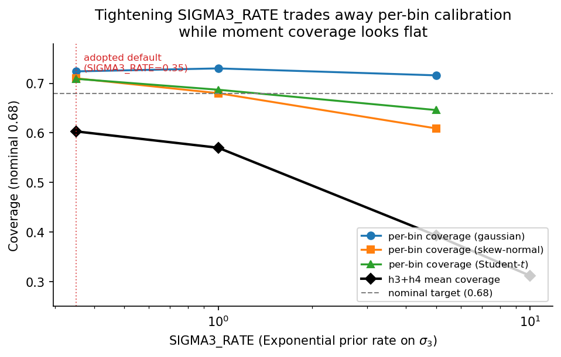

# Validation

This page summarises the statistical tests of the 1D (`KinematicSolver`) and
2D (`KinematicSolver2D`) solvers and the 2D performance gate, including one
known bias that is still unresolved. `PLAN.md` §1.2, §1.3, §3.3 and §3.4 give
the full methodology.

## What SBC validates

Simulation-based calibration (SBC; Talts et al. 2018) tests the sampler
against the model itself. Draw parameters from the prior, simulate data from
them, fit the data, and record where the true value ranks among the posterior
draws. If the implementation is correct, those ranks are uniform. A wrong
random-walk prior, a design matrix off by half a bin, or a `numpyro.factor`
term that `Predictive` cannot see all show up as non-uniform ranks. SBC says
**nothing** about whether the model describes real data well.

## What coverage validates

Coverage tests check the model against reality. We take a few fixed,
physically motivated truths (not drawn from the prior), simulate many mock
datasets from each, fit them, and count how often the true value lands inside
the 68% credible interval. This is what matters for a consumer like
Dynamite's NNLS $\chi^2$, which takes the reported uncertainties at face
value. Coverage can fail even when SBC passes, because SBC's truths always
agree with the prior. A prior that smooths away real sharp features is
invisible to SBC but shows up directly in coverage.

## Reading the metrics

Each metric answers a different question and has its own blind spot:

| Metric | Asks | Target | Blind spot |
|---|---|---|---|
| SBC failure fraction | What share of simulations could not be evaluated (NaN, crash, too few independent draws)? | ≤ 2% | It is a count: at n=30 a difference of one is noise. Only large gaps (17% vs 2%) are real. |
| SBC rank uniformity (KS p) | Does the truth fall at a uniform quantile of the posterior? | p > 0.05 | Computed only over simulations that *completed*. If the hard cases are the ones failing, this is calibration on the easy subset. |
| ESS | How many independent draws, out of the nominal count? | ≫ 20 | Says nothing about correctness: a chain can mix well around a wrong answer. |
| Moment coverage | Does the credible interval contain the true moment? | 0.68 | Gameable: a useless estimator with huge error bars scores perfectly. Read with efficiency. |
| **Per-bin LOSVD coverage** | Does `losvd_median ± losvd_uncertainty` contain the true mass, bin by bin? | 0.68 | Empty bins over-cover trivially (~0.88) because the uncertainty floor dominates; they must be excluded. |
| Efficiency | Estimator scatter ÷ statistical optimum (`σ/√N` for the mean, `σ/√(2N)` for the dispersion). | 1.0 | With few realisations a single bad fit dominates. Use a robust (16–84 percentile) scatter. |
| Bias | Systematic offset in the recovered value. | ≈ 0 | Only meaningful against a scale: compare to the optimal precision, not to zero. |

### Three traps

**Efficiency below 1.0 is not a win.** Nothing can beat the statistical
optimum, so a value under 1.0 means the prior is pulling estimates toward a
common answer. Always read it together with the bias.

**Good moment coverage does not mean good per-bin coverage.** The moments
compress about 37 bins into 5 numbers, and intervals that are too wide in one
bin can cancel ones that are too narrow in another. Tightening `SIGMA3_RATE`
from 1.0 to 5.0 left every moment metric unchanged while per-bin coverage on
`skew_normal_h3` fell from 0.680 to 0.609. Dynamite's $\chi^2$ uses the
per-bin values, so when the two disagree, per-bin coverage is the one that
counts.

**A shrinkage prior scores well on moments whose true value is zero.**
`flat_top_tangential` and `student_t_h4` are symmetric, so their true
skewness is about 0. A tight prior pulls skewness toward 0 and gets
near-perfect coverage for the wrong reason. Check whether a truth actually
has signal in a moment before reading its coverage. For the same reason, a
Gaussian truth cannot tell you what a Gaussian-core prior costs.

### How they combine

SBC is a pass/fail gate, not something to optimise; results near the
threshold count as ties. Among configurations that pass, choose by what is
recovered: per-bin coverage first, then the moments that carry real signal.

## 1D solver results

**SBC** (`tests/test_calibration.py`, `n_bins=15`, `n_stars=200`,
500 warmup + 1200 samples, `n_sims=30`) passes for both the RW1 and
Gaussian-core priors, with no failed simulations. The harness runs over
`SBC_PRIORS = ["rw1", "gaussian_core"]`.

The result depends on the sampler settings as well as the model. At NumPyro's
default `target_accept_prob=0.8`, the Gaussian-core prior fails, with 17% of
simulations discarded for low effective sample size on `sigma3`. The cause is
a funnel: as the deviation scale approaches zero the posterior narrows into a
neck, and a step size tuned on the wide part of the funnel cannot get through
it. Raising the target to 0.95 fixes this (1 failure in 100 at
`n_sims=100`). More warmup does not help: 1500 warmup steps at 0.8 still
failed. See "Sampler configuration" below.

SBC also caught an early bug. The first random-walk prior used
`numpyro.factor` on an unconditioned base measure, which `Predictive` cannot
see, so the SBC "truths" were drawn from the wrong distribution. After the
prior was rewritten generatively, SBC passed.

**Prior-predictive null space** (`tests/test_prior_predictive.py`). On a
400 km/s grid, the Gaussian-core prior's median prior-predictive dispersion
is about 32 km/s, against about 115 km/s for a uniform distribution. This
confirms the null space is quadratic rather than flat. It varies by less
than 3% across `n_bins` = 20, 40 and 80.

**Bias** (`tests/test_moment_bias.py`). For a Gaussian truth (σ = 40 km/s,
N = 150, `n_bins` of 20 and 80), the Gaussian-core prior gives
|kurtosis bias| < 0.35 and |σ bias| < 3%, and the σ bias does not grow with
the number of bins. The RW1 prior, kept as a negative control, still shows
its known +1.1 kurtosis and +4% σ bias at `n_bins` = 80. An earlier version
of this test passed for the wrong reason: the deviation term was effectively
switched off (marginal SD about 0.0036), and a posterior collapsed onto a
Gaussian meets Gaussian-truth thresholds trivially.

**Coverage** (`tests/test_coverage.py`, `n_real=25` per truth,
`n_stars=150`, `n_bins=20`; truths: Gaussian, Student-$t$ with $\nu=6$,
skew-normal, counter-rotating bimodal; run for both priors). For the
Gaussian-core prior without truncation this test **fails**, as it did before
the RW3 scaling fix. It is a known failure, not a regression, and is marked
`xfail(strict=False)` so that an improvement shows up as an XPASS.

The Gaussian truth over-covers in kurtosis (1.000; all 25 intervals contain
the truth) and skewness (0.960). The error bars are conservative but valid.
This says nothing about the deviation term, since kurtosis coverage was also
1.000 before the fix: a posterior collapsed onto a Gaussian covers a Gaussian
truth perfectly.

The non-Gaussian truths still under-cover in kurtosis and `tail_weight`.
Before and after the fix:

- bimodal kurtosis: 0.000 → 0.320
- bimodal `tail_weight`: 0.000 → 1.000
- Student-$t$ kurtosis: 0.000 → 0.040 (still below the 0.30 floor)
- skew-normal skewness and kurtosis: 0.000 → 0.000

An earlier version of this page blamed the remaining under-coverage on "an
inherent finite-data limitation". That diagnosis was made while the
deviation term was inert and has been withdrawn. The cause, especially for
the skew-normal case, is still open. The full table is in
`docs/superpowers/plans/2026-08-03-rw3-measurements.md`. For the RW1 prior,
`n_sigma_truncate=3.0` is applied (see `analysis.truncate_pdf_samples`), and
the test stays `xfail` until heavy-tailed truths are handled better; see
`PLAN.md` §1.3.

**Deviation prior** (`sigma3` in `generate_gaussian_core_curve`). The
deviation is scaled with the Sørbye–Rue generalised-variance constant
(Sørbye & Rue 2014, *Spatial Statistics* 8, 39–51), so `sigma3` is the
typical log-density departure from a Gaussian at any grid resolution. Its
prior is a penalised-complexity prior (Simpson et al. 2017, *Statistical
Science* 32, 1): an exponential whose base model, `sigma3 = 0`, is an exact
Gaussian. A prior-predictive check confirms that non-Gaussian LOSVDs are
reachable: at `SIGMA3_RATE=0.35` and `n_bins=40`, the 90th percentile of
|excess kurtosis| is about 38.8.

That check sets bounds rather than choosing a rate. The 90th percentile is
38.8 at rate 0.35, 1.13 at 5.0 and 1.05 at 50, so every rate from 0.35 up
passes its 0.3–50 bounds. SBC and per-bin coverage pick the rate. This test
only catches the two gross failures: a prior too tight to allow any
non-Gaussian shape, or one so loose that draws collapse into narrow spikes.

**Adopted setting.** The default is `SIGMA3_RATE=0.35` at `rw_order=3`, the
loosest rate measured. At the science target (σ = 22, `n_real=100`), 41 of
45 coverage entries fall in the nominal band and 1 fails badly; efficiency is
1.13× on `v_mean` and 1.35× on `sigma`.

Tightening the rate would also make SBC pass, by removing the funnel, and was
rejected. The funnel is where the non-Gaussian shape information lives, and
removing it costs shape recovery. The cost does not show in the moments, but
it is clear per bin:

| `SIGMA3_RATE` | per-bin coverage (gaussian / skew / student-t) | h3+h4 mean coverage |
|---|---|---|
| **0.35** | **0.724 / 0.710 / 0.709** | **0.603** |
| 1.0 | 0.730 / 0.680 / 0.687 | 0.570 |
| 5.0 | 0.716 / 0.609 / 0.646 | 0.393 |
| 10.0 | — | 0.312 |



*The table above as a plot. Per-bin coverage for the non-Gaussian truths
drifts down as the rate tightens, and h3+h4 coverage falls steadily.
0.35, the loosest rate measured, is the default.*

Coverage, efficiency and bias on `v_mean` and `sigma` are flat over this
whole range, which is why the cost went unnoticed until per-bin coverage was
measured. Fixing the sampler instead costs about twice the wall time and
nothing else. The decision is recorded in
`docs/superpowers/specs/2026-08-03-regularisation-decision.md`.

Two other ideas were tested and ruled out; do not revisit them without new
evidence. Raising the random-walk order to 4 or 5 does not free h3/h4
(retention stays around 0.13–0.16), because the null space belongs to the
*log*-density and the softmax separates it from the moments of the PDF.
Using separate scales for different modes fails for a related reason: all
of the shape and all of the roughness sit in the same two smoothest modes,
so two scales have nothing to separate.

`KinematicSolver.run()` uses `prior="gaussian_core"` by default; pass
`prior="rw1"` for the old behaviour. The order is fixed at 3. `rw_order` is
exposed on `generate_gaussian_core_curve` and `model_gaussian_core` only so
the tests can re-check the rejected higher orders.

## Sampler configuration

`KinematicSolver.run()` changes three NumPyro defaults, each based on
measurements. All three are constants in `veldist.veldist` that the SBC
harness imports, so the tests always check what the solver actually uses.

| Setting | veldist | NumPyro | Why |
|---|---|---|---|
| `target_accept_prob` | **0.95** | 0.8 | `sigma3` sits in a funnel; at 0.8, 17% of SBC simulations fail on inadequate ESS |
| `dense_mass` | **True** | False | The `d3` components are correlated through the cumulative sum and the null-space projection |
| `num_chains` | **4** | 1 | r_hat needs more than one chain, and nothing else detects a chain settling into the wrong mode |

The dense mass matrix matters most. On a skew-normal mock (37 bins, 150
stars, 4 chains), it raises the minimum ESS on `intrinsic_pdf` from 119 to
1188 and lowers the maximum r_hat from 1.0161 to 1.0015, and it is *faster*,
because a better-conditioned problem needs fewer leapfrog steps per sample.
The r_hat of 1.0161 is above the usual 1.01 threshold, and with a single
chain nothing would have reported it.

The chains run one after another unless you ask for CPU devices **before**
JAX starts:

```python
import veldist
veldist.set_host_devices(4)   # call before any other JAX work
```

The results are the same either way; only the wall time changes, by about
4×. `run()` warns if the call comes too late.

## Per-bin LOSVD calibration

Moment coverage is only a summary of what Dynamite uses. Its $\chi^2$ treats
`losvd_median` and `losvd_uncertainty` as independent Gaussian measurements
in each bin, so those per-bin intervals are what must be calibrated.

`test_per_bin_losvd_coverage` (`tests/test_coverage.py`, `n_real=25`)
measures them directly. It uses the output of `clip_uncertainties` rather
than the raw samples, because the uncertainty floors applied there are part
of what gets written. Mean coverage over informative bins, against 0.68:
Gaussian 0.724, skew-normal 0.710, Student-$t$ 0.709. No informative bin
falls below the 0.30 floor.

Empty bins are left out and reported separately. The relative uncertainty
floor dominates them, so they over-cover at about 0.88, and including them
would inflate the result.

## The measured observing profile

`veldist.calibration.OMEGACAT` started as a hand-typed estimate of the
target dataset's observing conditions. It has since been measured from the
oMEGACat line-of-sight catalogue with `ObservingProfile.from_data`. After
the standard quality cuts (`selection_hq_los` and
`selection_hq_astrometry_and_membership`), 24,925 of 717,934 stars remain.
The fitted profile is in `tests/data/omegacat_profile.json`.

| Parameter | Measured | Hand-typed (`OMEGACAT`) |
|---|---|---|
| `err_median` | 4.00 km/s | 2.5 km/s |
| `err_log_sigma` | 0.62 | 0.4 |
| `sigma_max` | 19.04 km/s | 22.0 km/s |
| `sigma_min` | 13.37 km/s | 7.0 km/s |
| `rotation_span` | 6.99 km/s | 10.0 km/s |

**The hardest case does not exist.** The hand-typed `sigma_min = 7` km/s
made a narrow-dispersion regime the hardest test case, but the real minimum
is 13.37 km/s. Meanwhile the easiest case is harder than assumed: the
measured `err/sigma` runs from 0.21 to 0.30, against an assumed 0.11 to
0.36. The validation therefore covered a wider range of difficulty than the
data need, centred in the wrong place. No existing measurement is
invalidated, but any claim that the method "passes even in the hardest bin"
referred to a bin that never occurs.

**Information content of real bins.** With `sigma_ref = 19.04`, the per-bin
information (ivar) runs from 0.389 to 0.410, median 0.393. `ivar / n_stars`
varies by only 1.1% across the field: with `err` around 4 km/s and `sigma`
around 19 km/s, `err^2` is much smaller than `sigma^2` everywhere, so ivar
reduces to `N / sigma^2`. The outer third of the bins is, if anything,
tighter.

**So for this dataset, binning by information content and binning by star
count are equivalent**, and the measured threshold can be applied as a star
count. `veldist.binning` is still useful for data whose errors approach the
intrinsic dispersion, and `min_ivar` in `fit_all_bins` is the more general
way to express the cut.

**Caveat.** The catalogue has no stored Voronoi assignment, so the
measurement used radial annuli of about 150 stars instead. Constant ivar
from bin to bin is therefore partly built in. Normalising by `n_stars` makes
the conclusion robust to that, but checking against the real Voronoi bins
would settle it.

The recovery campaign (below) found that both `v_mean` and `sigma` are
calibrated at every information content down to ivar 0.1.

## Comparison against a Gaussian MLE baseline

`veldist.baseline.gaussian_mle` maximises
`sum_i log N(v_i | mu, sqrt(sigma^2 + err_i^2))` over `mu` and `sigma`: the
classic two-parameter fit of an error-convolved Gaussian. For a Gaussian
LOSVD with known Gaussian errors this is the exact maximum-likelihood
solution, so `veldist` cannot beat it there. Matching it is the pass
condition.

**The first two moments match.** For a Gaussian truth with 150 stars per
bin, the ratio of `veldist`'s 68% credible-interval half-width to the MLE's
analytic standard error is 0.999 ± 0.003 for `v_mean` and 1.016 ± 0.005 for
`sigma`, pooled over 60 mocks in three independent seed blocks. The
37-dimensional non-parametric posterior is as precise as the two-parameter
optimum to within about half a percent.

This ratio is only as good as its denominator, so the MLE errors were
checked separately: over 5000 realisations at N = 150, the expected-Fisher
error matches the actual scatter of the MLE estimates to within 0.2–0.7%.

**The tie holds for all nine truths** in the calibration library
(`veldist.calibration.make_truths`), not just the Gaussian. All 18
truth-by-metric comparisons are statistical ties (maximum |t| of 1.41), and
`veldist` comes out ahead in 10 of 18, as expected from chance. The two
estimators agree to about 0.05 km/s per realisation, against per-realisation
errors of about 1 km/s.

The tie is expected. `Truth.scaled(sigma)` gives every truth the same second
moment, so any correct second-moment estimator recovers `sigma` whatever the
shape. Accordingly, the MLE's `sigma` bias is a uniform −0.07 to −0.12 km/s
across all nine truths, which is ordinary small-sample MLE bias rather than
misspecification. An earlier version of this test assumed the MLE would be
biased on non-Gaussian shapes; that was wrong and has been removed.

This is a good result. The non-parametric model allows any shape and pays
nothing for it on the first two moments.

**The difference is in the shape.** On `bimodal_counter_rotation`, the total
variation distance from the true LOSVD is 0.0712 for `veldist` and 0.2168
for the Gaussian MLE: a paired difference of 0.1457 ± 0.0046 over 20
realisations, t = 31.8. The t value is large mostly because the scatter of
the difference is tiny (0.0205). The truth is two well-separated Gaussians at
±18 km/s, so a single Gaussian has to straddle the gap in every
realisation. Its error is systematic, not random.

One caveat: `veldist`'s `intrinsic_pdf` is mass per bin, while the truth and
the MLE curve are evaluated as densities at bin centres and renormalised.
The two differ at second order in bin width, and the mismatch works against
`veldist`, so the threefold advantage is if anything an underestimate.

In short, the case for `veldist` over a two-parameter fit rests on the
recovered distribution and its shape, not on `v_mean` or `sigma`. The
agreement on the first two moments shows that `veldist` gets the easy case
right; it is not a claim of superiority.

### Percentile-to-Gauss-Hermite mapping

`veldist.calibration.PROXY_TO_GH` records how the percentile-based shape
statistics (`skew_pct`, `kurtosis_pct`) relate to the Gauss-Hermite
coefficients (`h3`, `h4`). For smoothly non-Gaussian LOSVDs, `h4` is about
0.633 × `kurtosis_pct`. This is the median over the five eligible truths;
the four smooth ones range from 0.604 to 0.659.

The exception is `cold_disk_component`, a 4% kinematically cold
sub-population. There `kurtosis_pct` is slightly positive (+0.0047) while
`h4` is negative (−0.0160). The two disagree in sign on a realistic case, so
`kurtosis_pct` on its own can point the wrong way for a small cold
component.

`skew_pct_to_h3` rests on only three eligible truths and is poorly
constrained; trust it less than the `h4` mapping. Both mappings are
calibrated only for `|h3| <= 0.15` and `|h4| <= 0.10`. Beyond that, use
`bimodality_score` rather than converting to GH.

### Recovery-curve results

`veldist.calibration.recovery_curve` sweeps the information content of an
`ObservingProfile` and reports, for each metric, the ivar below which
coverage or the CI ratio stops being calibrated. Information content is
`sum_i 1/(sigma^2 + err_i^2)`, **not** `1/err_i^2`: a star pins down the
LOSVD centre only to within the intrinsic spread it was drawn from, however
small its measurement error.

The campaign swept six ivar values around the real data (0.1, 0.2, 0.39,
0.8, 1.6, 3.2) at two dispersions (19.04 and 13.37 km/s) and four truth
shapes (gaussian, student_t_h4, skew_normal_h3, two_population), with 40
realisations each: 1920 NUTS fits and 192 rows. It used the measured
`omegacat_profile.json`, not the hand-typed `OMEGACAT` values.

**Both `v_mean` and `sigma` are calibrated at every information content
down to ivar = 0.1**, the lowest value swept, at both dispersions. The real
threshold may be lower. Real oMEGACat bins sit at ivar 0.39, well inside the
calibrated range.

| Metric | Mean coverage | Nominal | CI/CR range | Cells in NOMINAL_BAND |
|---|---|---|---|---|
| `v_mean` | 0.716 | 0.68 | 0.93-1.02 | 48/48 |
| `sigma` | 0.657 | 0.68 | 1.03-1.17 | 48/48 |

Coverage is judged with the repository's `NOMINAL_BAND`, the 99% binomial
band at `n_real=40` (0.475–0.850). All 48 cells for each metric fall inside
it. An earlier smoke run used `min_coverage=0.60`, which is too strict at
`n_real=40`: the binomial standard error there is 0.074, so 0.60 is only one
standard error below nominal. The "sigma threshold at the top of the range"
it reported was an artefact of that gate. The correct floor is
`coverage_floor(n_real)` in `veldist.calibration`.

For `sigma`, the posterior half-width is 3–17% wider than the Cramér-Rao
bound, so the non-parametric flexibility costs a few percent of precision on
`sigma` and nothing on `v_mean`.

`sigma` is biased slightly low, typically by 0.2–0.5 km/s (1–3%), with no
trend with information content. This fits mild prior shrinkage toward a
narrower distribution and is not a concern given the coverage.

Skewness and kurtosis are not calibrated at any information content: coverage
collapses for skew_normal_h3 on both and for student_t_h4 on kurtosis. This
matches the per-bin results above. These metrics are not part of the
acceptance criteria (see `TASKS.md`).

**Conclusion for binning.** Real oMEGACat bins at ivar 0.39 are well within
the calibrated range for `v_mean` and `sigma`, so the current binning is
adequate and coarser bins are not needed. The `min_ivar` floor in
`fit_all_bins` can be set conservatively below 0.1 (for example 0.05); it
then acts as a sanity check rather than a real constraint.

## 2D solver results

Everything below uses the `gaussian_core` prior, the default in
`KinematicSolver2D.run`. The older `gmrf` prior is kept only for comparison.

**SBC** (`tests/test_calibration_2d.py`, `K=10` (100 cells), `n_stars=250`,
500 warmup + 1200 samples, `n_sims=30`): all 6 test quantities pass for both
priors, with no failures. Following the 1D lesson, the 2D prior is fully
generative (`z ~ N(0, I)` followed by a deterministic Cholesky transform,
never a bare `numpyro.factor` penalty); `test_prior_predictive_is_smooth_2d`
checks this.

**Recovery.** `test_coverage_over_mock_realisations_2d` (moment coverage)
and `test_per_cell_losvd_coverage_2d` (per-cell coverage) run over the three
calibrated observing profiles in `calibration2d.py` (`HST_BRIGHT`,
`HST_FAINT`, `GAIA_OUTER`) and two truths (isotropic and anisotropic):

| Profile | err/sigma | N_stars | K (cells) | Moment cov. | Per-cell cov. | Notes |
|---|---|---|---|---|---|---|
| HST_BRIGHT | 0.014 | 400 | 15 (225) | PASS both truths | PASS both truths | Tightest test: no slack to hide bias |
| HST_FAINT | 0.147 | 400 | 15 (225) | PASS both truths | PASS both truths | Error kernel resolved at K=15 |
| GAIA_OUTER | 0.625 | 2000 | 15 (225) | XFAIL | XFAIL | Known-weak; err/sigma exceeds 1D's structural-failure threshold (0.36) |

Settings: `num_warmup=300`, `num_samples=600`, `prior="gaussian_core"`,
`n_real=25`, with the 99% binomial band `[0.44, 0.92]` on `mean_x`,
`mean_y`, `sigma_x` and `sigma_y`. `rho` is also gated on that band for
`gaussian_core` on `HST_BRIGHT` and `HST_FAINT` (both truths). It is only
excluded for `GAIA_OUTER` and `gmrf`, as in the table and in
`test_coverage_2d.py`; unlike 1D's h3/h4, it is not optional.

**These tests now score against the continuous truth.** This changed on
2026-09-01, and the table above was measured before the change.

They used to score against the *discretised* truth (probability mass per
cell, with moments at cell centres), on the grounds that a continuous target
would penalise the model for the ~h²/12 Sheppard offset. That was right for
the estimator at the time and wrong once the estimator was fixed. Three
parts of the code disagreed about what a cell value `p_m` means:

- the **likelihood** integrates each star's error kernel over the cell,
  which treats the density as constant within the cell, `p(v) ≈ p_m/h`, and
  gives the fitted density a variance of `Σ p_m (v_m − μ)² + h²/12`;
- the **reported moments** treated `p_m` as a point mass at the cell centre,
  with no within-cell term;
- the **truth** used cell-centre moments of the exact masses, `V + h²/12`.

The data push the first of these to `V`, so the reported variance was
`V − h²/12` against a target of `V + h²/12`. That is a gap of `h²/6` in
variance, or `−h²/(12σ)` in sigma. An isotropic control at 1600 stars (both
axes identical by construction, so truncation cannot interfere) confirms
it. Predicted versus measured sigma bias: K=15 −0.202 vs −0.196, K=19 −0.126
vs −0.129, K=21 −0.103 vs −0.099, within 4% at every resolution.

The estimator now adds `h²/12` per axis and estimates the continuous
quantity, so the continuous truth is the right target; the old one would
count the correction twice. `docs/handoff-2d-tilt-recovery.md` has the full
account.

**Grid resolution.** The profiling campaign behind these defaults is
described in the `cell_per_sigma` docstring in `calibration2d.py` and in
`TASKS.md`. It found K=15 (`cell_per_sigma=0.47`, 1.8 stars per cell) to be
the practical limit at N=400, with K=19 (1.1 stars per cell) failing on
anisotropic truths.

> **Treat those conclusions with suspicion.** The campaign ran with the
> uncorrected estimator, whose h²-scaling bias made fine grids look
> necessary. Much of the resolution requirement it found was that bias, not
> a property of the method. With the correction, K=15 (225 cells) gives a
> `sigma_y` bias of +0.004 and a `rho` bias of +0.003 at 1600 stars. Do not
> treat `cell_per_sigma=0.47` as a floor until it has been re-measured.

**Performance gate** (`PLAN.md` §3.4). Before considering SVI or
Pathfinder, the plan set a measurable gate: run K=20 (400 cells) and
N=5000 mock stars, with 500 warmup and 1000 samples on CPU over 4 chains,
and stay with plain NUTS if the wall time is under 10 minutes, the minimum
ESS/`n_samples` is above 0.1, and the maximum $\hat R$ is below 1.01.

| Criterion | Threshold | Measured | Verdict |
|---|---|---|---|
| Wall time | < 600 s | 87.9 s | PASS |
| min(ESS)/n_samples | > 0.1 | 3.11 | PASS |
| max($\hat R$) | < 1.01 | 1.0023 | PASS |

All three pass comfortably. ESS and $\hat R$ were checked on
`smoothness_sigma`, the latent `z` vector and `intrinsic_pdf`, not just the
easiest scalar; `intrinsic_pdf` was the limiting quantity for both. No
escalation is needed, so none of the fallback options (smaller K,
`dense_mass=True`, GPU, Pathfinder initialisation, full SVI) were built.
`PLAN.md` §3.4 has the full numbers and how to reproduce them.

## How to reproduce

These slow tests run real NUTS sampling and take from tens of seconds to
several minutes each. The default fast run
(`pytest tests/ -v --tb=short -m "not slow"`) skips them.

```bash
# 1D SBC
pytest tests/test_calibration.py -m slow -v

# 1D coverage (currently xfail on kurtosis, see above)
pytest tests/test_coverage.py -m slow -v

# 2D SBC
pytest tests/test_calibration_2d.py -m slow -v

# 2D coverage (moment + per-cell, parametrised over 3 profiles × 2 priors)
pytest tests/test_coverage_2d.py -m slow -v

# 2D unit tests (recovery, marginal consistency, design matrix)
pytest tests/test_veldist2d.py -m slow -v

# 2D Dynamite output writer + profile tests
pytest tests/test_dynamite2d.py tests/test_calibration2d_profile.py -v
```

The §3.4 performance gate is a one-off measurement rather than a pytest
test. It calls `numpyro.infer.MCMC`/`NUTS` on `model_2d` directly with
`num_chains=4`, which `KinematicSolver2D.run()` does not expose. See
`PLAN.md` §3.4 for the procedure.
